# 快速入门

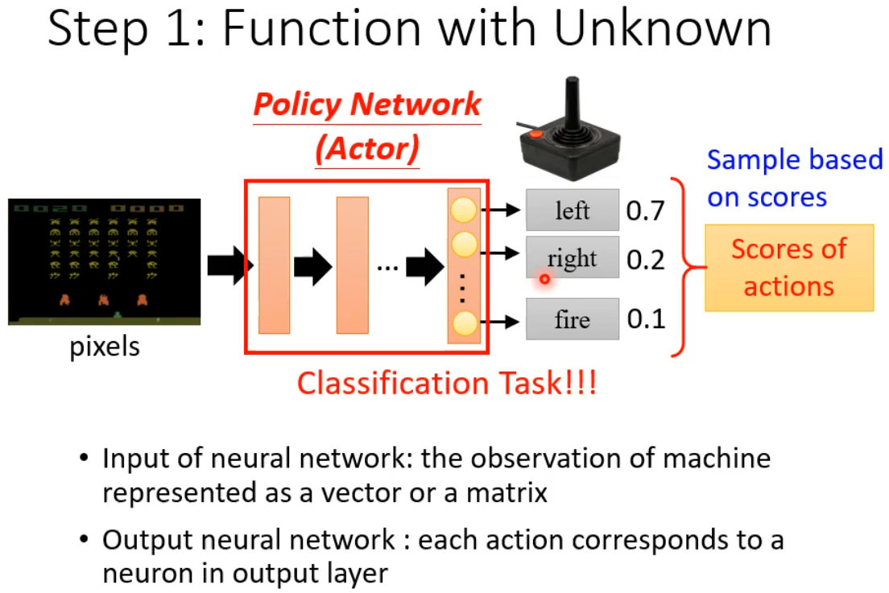

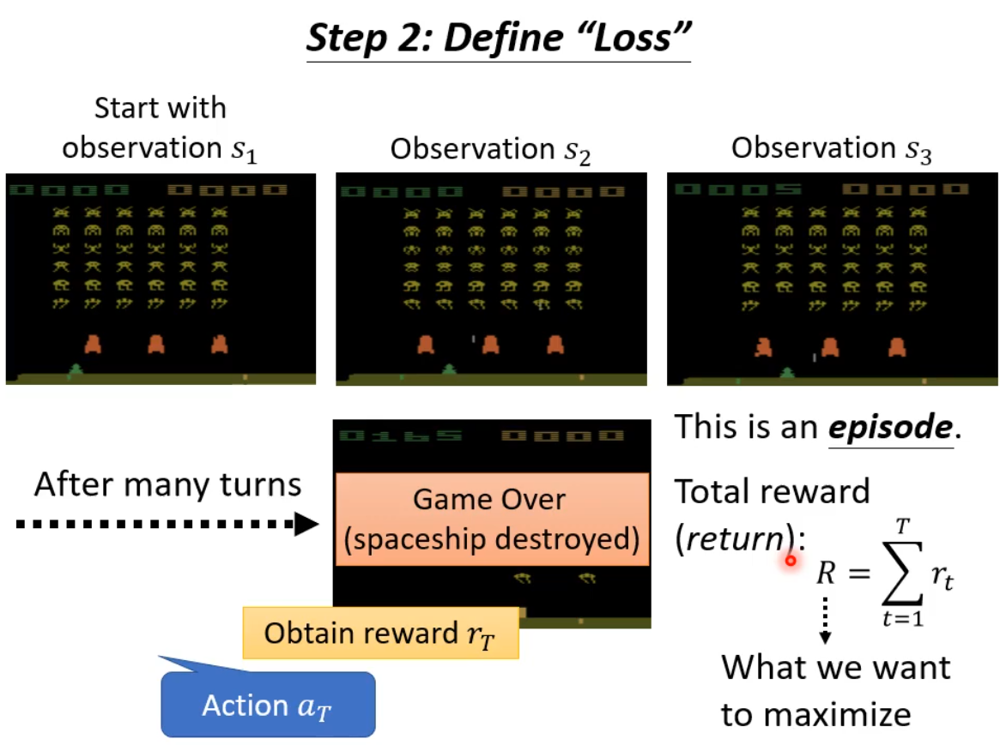

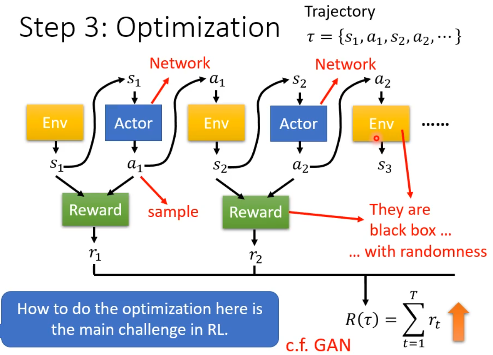

**问题**

- Reward函数是一个黑箱，无法梯度回传（很多时候根本不可导）。
- 全局最优不等于局部最优。模型有时候需要舍弃短期回报以获取更高的总回报。

**解决方案**

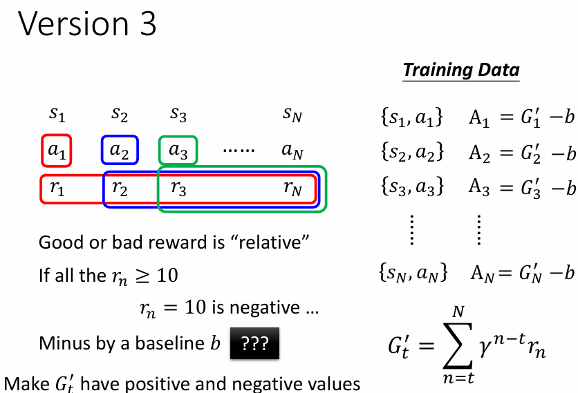

- 越远的reward与当前action关系越小。
- reward是相对的。

**问题**

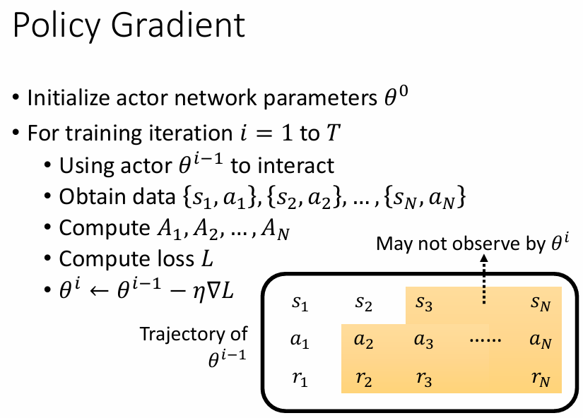

每收集一组数据，只能更新一次actor。

因为数据是上一个actor收集的，可能不适用于更新后的actor。

**解决方案**

 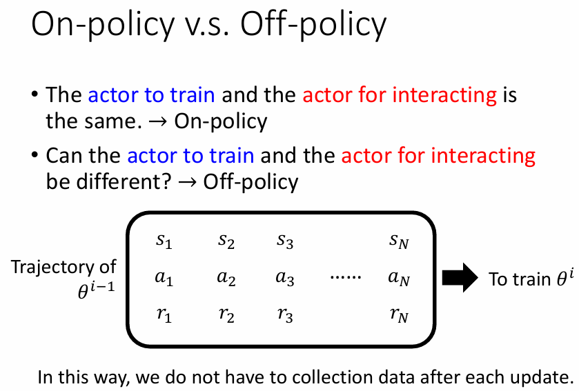

**问题&解决方案**

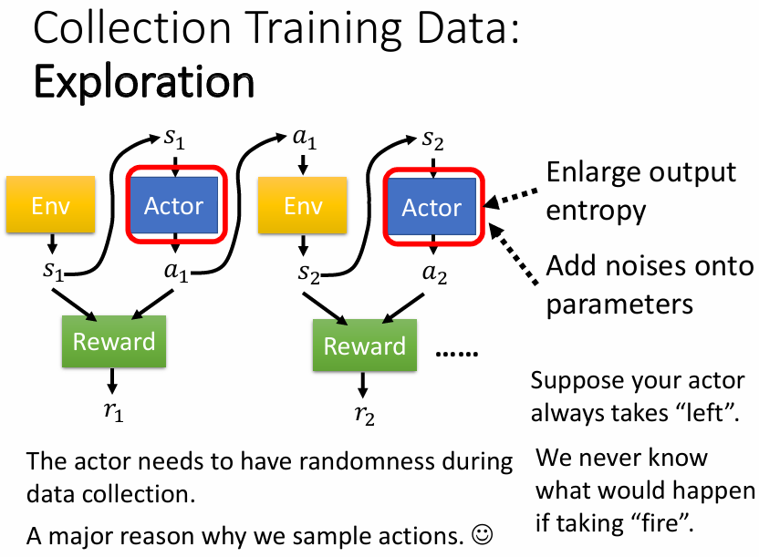

# 价值函数（value function）

概念：根据当前状态（或状态-动作对）估计长期净回报。

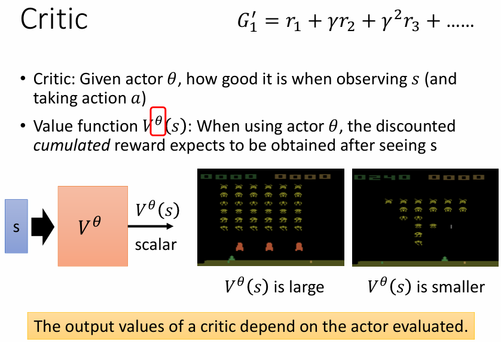

## 如何训练价值函数

### 蒙特卡洛（MC）方法

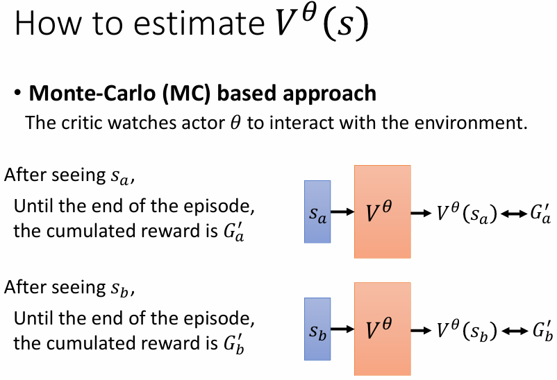

#### 优势：

1. **简单直观**：MC方法基于完整的回合（episode）来进行学习，即通过模拟一次完整的轨迹并使用该轨迹的总回报来更新估计。这种方法直观且易于理解。
2. **不依赖于模型**：MC方法是无模型的，它不需要知道环境的动态转移（状态转移概率或奖励函数）。只要能够执行回合，它就能学习。
3. **基于实际观察**：MC方法不涉及中间的估计或假设，完全依赖于实际的回报，减少了误差传播。

#### 缺陷：

1. **需要完整的回合**：MC方法需要等待一个完整的回合才能进行更新，这在某些环境下可能导致学习的效率低下，尤其是在长期回合（如复杂游戏）中，无法在中途获得及时的反馈。
2. **高方差**：由于MC方法是基于整个回合的实际回报进行更新的，因此它的估计可能有较高的方差，尤其是在回报波动较大的环境中。
3. **不能用于部分可观测的环境**：如果在某些情况下，智能体无法看到回合的结尾或回报，则MC方法无法有效工作。

### 时序差分（TD）方法

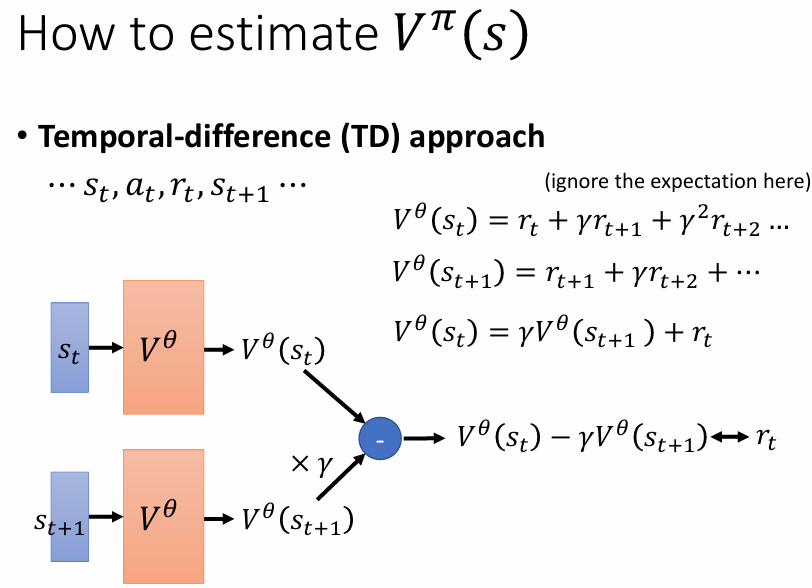

#### 优势：

1. **即时更新**：TD方法不需要等待回合结束，而是通过对当前状态的估计进行逐步更新，因此它比MC方法学习更迅速。在许多实际问题中，TD方法能够更快地收敛。
2. **低方差**：TD方法依赖于当前估计来更新未来的值，因此它在更新过程中更为稳定，方差较小。相比之下，MC方法有时可能会产生高方差。
3. **适用于部分可观测的环境**：TD方法可以在每个时刻更新，因此即使环境不是完全可观测的，智能体也能根据当前的观察不断更新自己的策略。

#### 缺陷：

1. **偏差问题**：TD方法通常会引入偏差。因为它使用当前的估计值（例如，下一个状态的价值）来进行更新，所以如果估计值不准确，可能会导致偏差的积累。与MC方法不同，TD方法并不会等到回合结束才进行估计，所以它可能会“错误地”调整价值估计。
2. **需要更精细的调节**：TD方法的学习过程依赖于一个重要的参数——学习率（α）。如果学习率设置不当，可能导致收敛慢或过度波动。
3. **对环境模型的依赖性**：虽然TD方法比MC方法更具效率，但它依然是基于当前状态和下一状态的估计的。如果状态转移不准确，可能导致学习效率下降。

### 总结：

- **MC方法**适用于回合结束后有明确回报的环境，且当环境中的回报方差较低时，它通常能够提供较为准确的估计。然而，它的学习过程较慢，且无法在部分可观测的环境中有效应用。
- **TD方法**则适用于需要逐步反馈的环境，能够更快地进行在线学习，并且在部分可观测的环境下表现良好。其缺点在于可能引入偏差，需要较为精细的调节和较强的探索。

# Actor-Critic方法

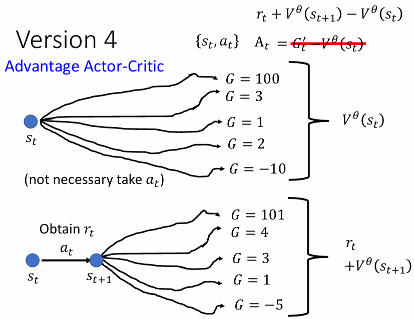

**Actor-Critic**方法是强化学习中的一种重要算法，它结合了**值函数方法**（Value-based）和**策略梯度方法**（Policy-based），通过同时学习一个“**Actor**”和一个“**Critic**”来提高学习的效率和稳定性。具体来说，**Actor-Critic**方法将策略优化和价值估计分开，允许在强化学习中使用更复杂的策略。

### 1. **Actor-Critic方法的框架**

- **Actor**：负责根据当前策略选择行动，或更新策略。这是策略优化部分，通常通过一个**神经网络**来表示，该网络学习从当前状态到动作的映射（即策略π）。
- **Critic**：负责评估Actor选择的动作好坏，通常通过估计状态价值（V(s)）或行动价值（Q(s,a)）来提供反馈。Critic的目标是最小化估计值与实际回报之间的误差。

### 2. **工作流程**

1. **状态观察**：智能体观察当前状态 $s_t$。

2. **Actor选择动作**：基于当前状态 $s_t$，Actor选择一个动作 $a_t$（根据当前策略 $\pi$）。

3. **执行动作**：智能体执行选定的动作 $a_t$，并从环境中获得奖励 $r_t$和下一个状态 $s_{t+1}$。

4. **Critic评估**：Critic根据当前状态 $s_t$ 和动作 $a_t$，估计一个价值函数（如状态价值V(s)或者动作价值Q(s,a)），并计算TD误差（Temporal Difference Error）：
   $$
   δ_t=r_t+γV(s_t+1)−V(s_t)
   $$
   其中，$\gamma$ 是折扣因子，控制未来奖励的权重。

5. **更新Actor和Critic**：

   - **Critic更新**：Critic通过TD误差来更新价值函数，使其更接近实际回报。
   - **Actor更新**：Actor根据Critic的反馈（即TD误差），通过策略梯度方法调整其策略，以增加获得更高回报的动作的概率。

### 3. **Actor-Critic的优势**

- **平衡了值函数和策略优化**：Actor-Critic方法既能通过Critic评估当前策略的好坏，又能通过Actor来不断改进策略，从而兼具值函数法和策略梯度法的优点。
- **低方差，高效的策略更新**：与纯粹的策略梯度方法相比，Actor-Critic通过引入Critic来减少梯度估计的方差，从而提高了学习的效率和稳定性。
- **适应性强**：Actor-Critic方法能够处理连续动作空间的问题，因为它直接优化策略（而非动作的离散概率分布）。因此，它比基于值函数的方法更适合连续空间的应用。

### 4. **缺点**

- **训练不稳定性**：尽管Actor-Critic方法比纯粹的策略梯度方法更稳定，但由于Actor和Critic同时在训练，有时会导致不稳定的学习过程。例如，如果Critic的估计错误，Actor可能会基于不正确的反馈更新策略。
- **需要更多的计算资源**：Actor-Critic需要维护和更新两个模型（Actor和Critic），这会比传统的单一模型方法更消耗计算资源和存储空间。
- **策略改进的速度较慢**：虽然Actor-Critic方法通过结合值函数和策略梯度来提高稳定性，但仍然可能遇到学习速度慢的情况，尤其是在复杂环境中。

### 5. **Actor-Critic的变种**

为了提高效率和稳定性，Actor-Critic方法有一些常见的改进和变种：

- **A3C（Asynchronous Advantage Actor-Critic）**：通过并行使用多个线程（每个线程在不同环境中进行训练），来加速训练并减少系统的训练时间。
- **A2C（Advantage Actor-Critic）**：是一种同步版本的A3C方法，优化了训练过程，通过使用“优势函数”（Advantage Function）来提高学习效果。优势函数通过减去基准值（如状态价值）来衡量一个动作的相对好坏。
- **DDPG（Deep Deterministic Policy Gradient）**：是一种用于解决连续动作空间问题的Actor-Critic方法，适用于无模型的连续控制任务。它结合了深度学习和强化学习技术，在连续动作空间中表现良好。
- **TRPO（Trust Region Policy Optimization）**：一种策略优化算法，通过对策略更新施加约束，确保更新的策略不会导致性能的大幅下降，从而提高训练稳定性。

### 6. **总结**

Actor-Critic方法通过将值函数和策略优化结合在一起，提供了一种强大且灵活的强化学习框架。它能够利用值函数对策略进行评估，从而提高学习过程的效率和稳定性。虽然其在训练稳定性上有一定的挑战，但通过一些改进和变种，已经成为强化学习中的重要算法之一，尤其是在处理连续动作空间和复杂环境时。

# Reward Shaping

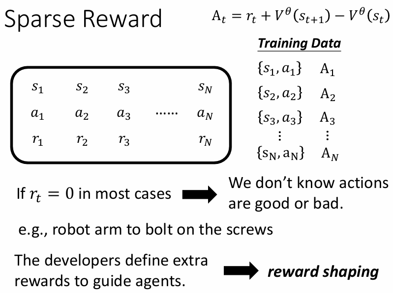

立即reward大部分情况下为0时，需要开发者额外设定reward。

# No Reward: Learning from Demonstration 

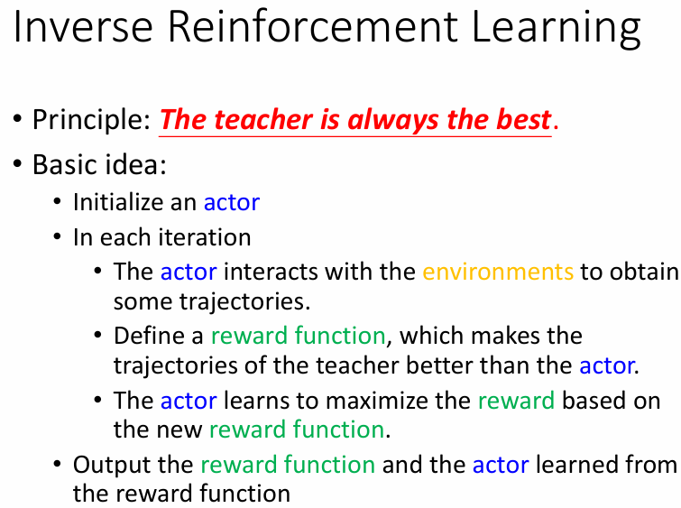

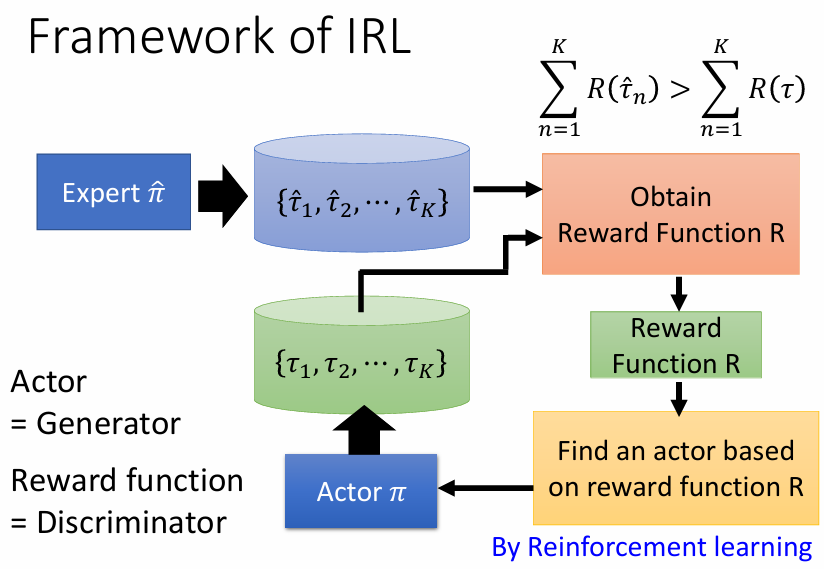

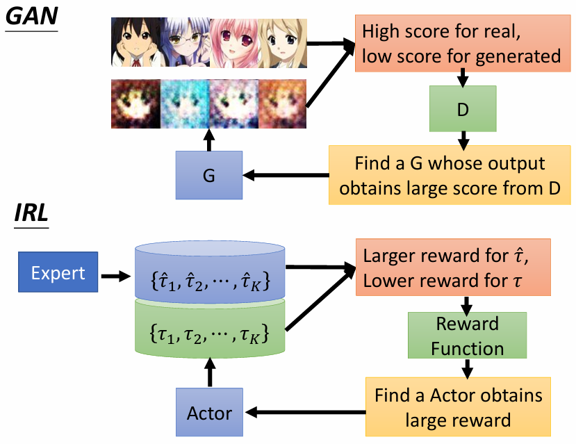
