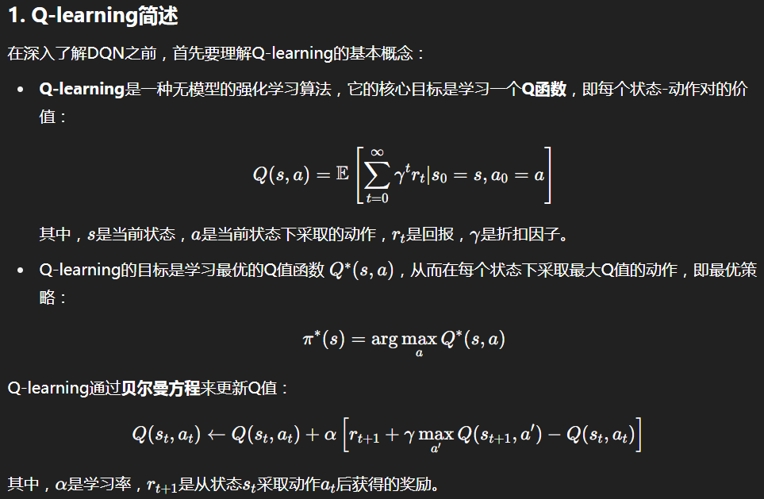
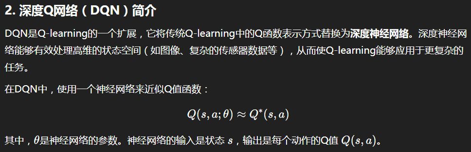
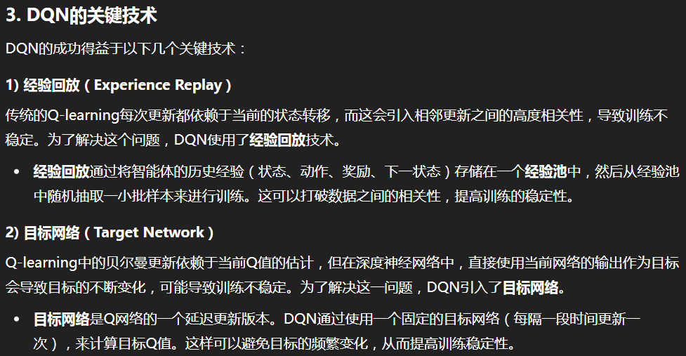
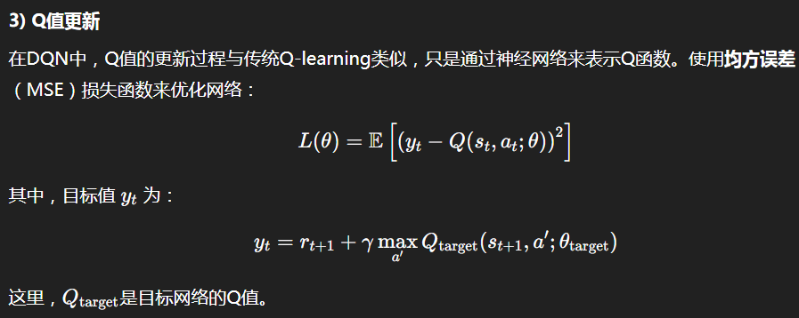
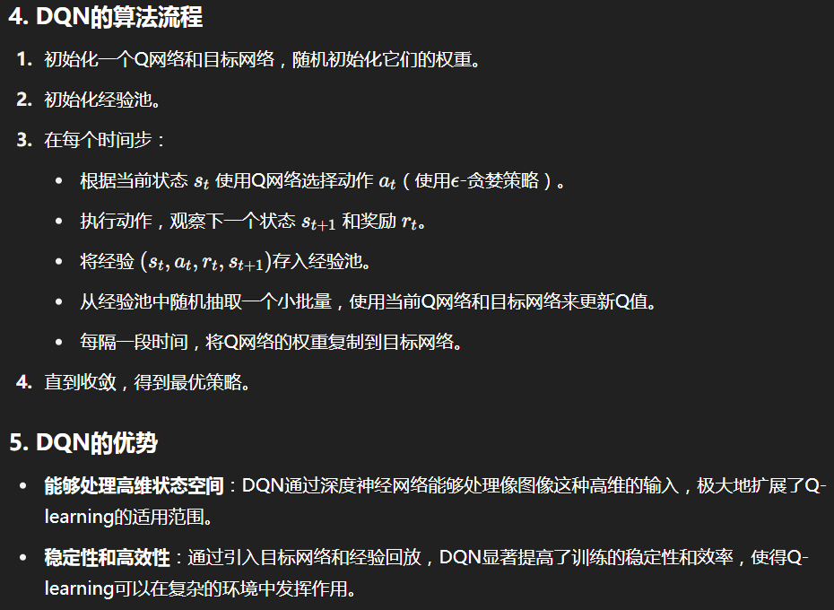
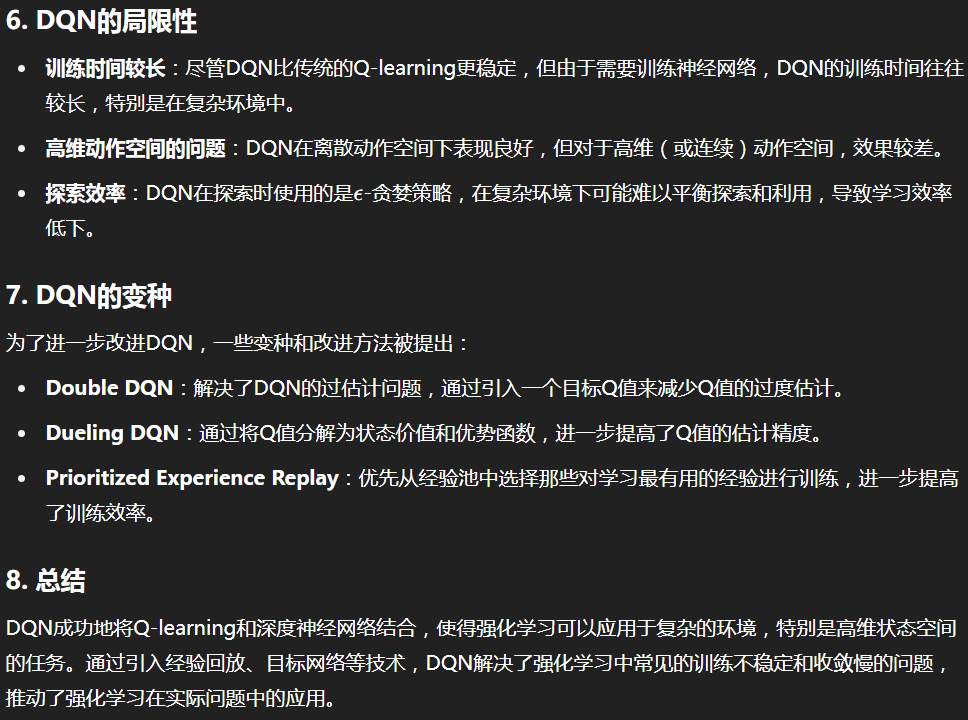

> 参考文献：Comprehensive Survey of Reinforcement Learning: From Algorithms to Practical Challenges

# 基本内容

目的：使智能体能够通过与环境的交互来学习最优行为。强化学习借鉴了试错法的基础，通过奖励或惩罚的形式反馈，使智能体能够做出明智的决策。

## 主要构成元素

1. 智能体（agent）

   感知环境、接受输入（state），执行动作（action）。

2. 环境（environment）

   智能体所处的环境。

3. 策略（policy）

   state到action的映射。

   决定了智能体在特定时刻的行为。

4. 奖励信号（reward signal）

   奖励信号决定了智能体在给定环境中的行为。

   在每一个时间步，环境会向智能体发送一个数字，即奖励。最终，智能体的唯一目标是最大化它获得的总奖励。

5. 价值函数（value function）

   从可能的状态集合到它对一旦访问某个状态（或状态-动作对）并继续遵循当前策略后，所能期望的长期净奖励的**估计**。

6. （可选的）环境模型（model of the environment）

   模拟环境的行为，或者更广义地说，可以用来推测环境将如何表现。

## Markov Decision Process (MDP)

MDP（Markov Decision Process，马尔可夫决策过程）是强化学习的数学基础框架，它为智能体在不确定环境中进行决策提供了形式化的描述。

MDP的目标是为决策者提供一个最优的策略π：S → A。

MDP是一个五元组 (S, A, P, R, γ)，其中：

- **S**: 状态空间，包含环境中所有可能的状态
- **A**: 动作空间，包含智能体可以执行的所有动作
- **P**: 状态转移概率函数，P(s'|s,a) 表示在状态s执行动作a后转移到状态s'的概率
- **R**: 奖励函数，R(s,a) 或 R(s,a,s') 表示在某种情况下获得的即时奖励
- **γ**: 折扣因子（0≤γ≤1），用于平衡即时奖励和未来奖励的重要性

### 马尔可夫性质

MDP的核心是马尔可夫性质，即"未来只依赖于现在，而与过去无关"。数学上表示为：

$$
P(S_{t+1}|S_t, A_t, S_{t-1}, A_{t-1}, ...) = P(S_{t+1}|S_t, A_t)
$$
这意味着下一个状态只取决于当前状态和当前动作，而不需要知道历史信息。这个假设大大简化了问题的复杂性。

# 算法

## PolicyGradient

直接对策略函数进行参数化并通过梯度上升来优化策略参数，以最大化期望累积奖励。

## Q-Learning

