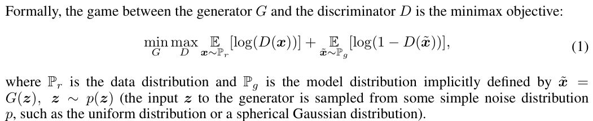
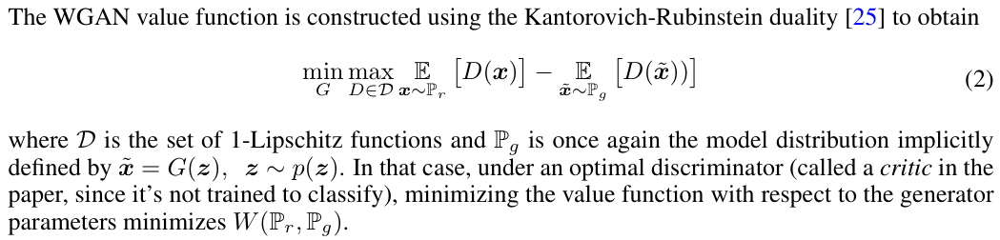
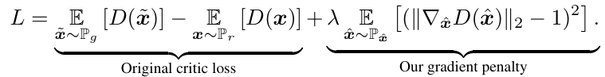
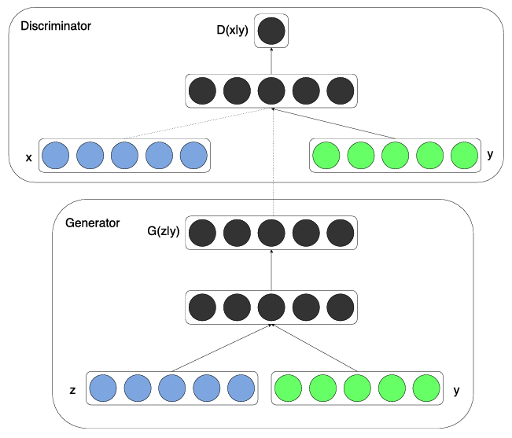
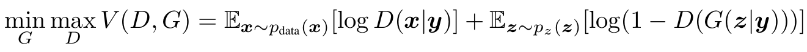
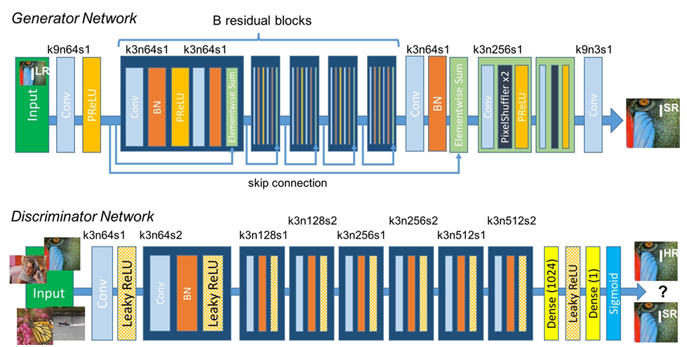
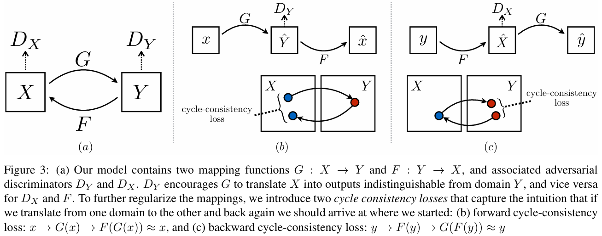
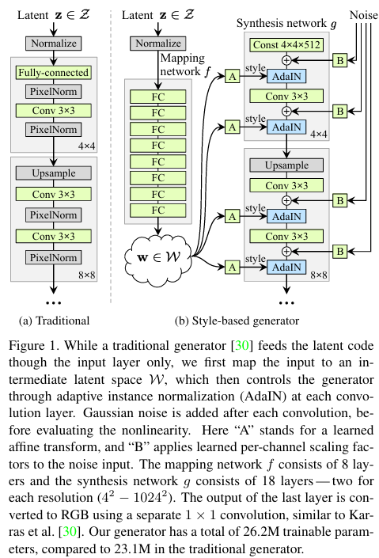

# GAN (2014)

论文：Generative adversarial nets

# WGAN (2017)

论文：Wasserstein gan

gan难以训练，wgan提出用Wasserstein距离作为损失函数。训练更稳定。

WGAN要求判别器必须位于1-Lipschitz函数的空间内，通过**权重裁剪**来强制执行。

# WGAN-GP (2017)

论文：Improved Training of Wasserstein GANs

- 权重裁剪会导致优化困难，难以收敛。
- 使用梯度惩罚（Gradient penalty）替代权重裁剪，同样可以强制判别器满足1-Lipschitz约束。
- 使用 LN 替代 BN。因为梯度惩罚是针对单个输入的，而非整个batch。

# CGAN (Conditional GAN) (2014)

论文：Conditional Generative Adversarial Nets

在G的输入中添加标签向量实现条件生成

在D的输入中也添加标签向量

- 正样本：真实图片和真实标签
- 负样本：生成的图片和G输入的标签

# DCGAN (2015)

论文：Unsupervised Representation Learning with Deep Convolutional Generative Adversarial Networks

GAN一开始用的MLP，这里换成了CNN

# SRGAN （2016）

论文：Photo-Realistic Single Image Super-Resolution Using a Generative Adversarial Network

使用感知损失： perceptual loss = content loss + adversarial loss = (MSE loss + VGG loss) + adversarial loss

用途：图像超分

# CycleGAN (2020)

论文：Unpaired Image-to-Image Translation using Cycle-Consistent Adversarial Networks

GAN损失+循环一致性损失

用途：图像风格迁移

# StyleGAN (2019)

论文：A Style-Based Generator Architecture for Generative Adversarial Networks

用途：生成特定风格的图片。

但是必须先测试出不同的风格向量 z 对应什么图片，然后在多个 z 之间进行插值来得到想要的风格的图片。

因此无法精确控制。

## StyleGAN2 （2019）

论文：Analyzing and Improving the Image Quality of StyleGAN

把AdaIN删了，以及一些其他小改动，提升生成质量。

