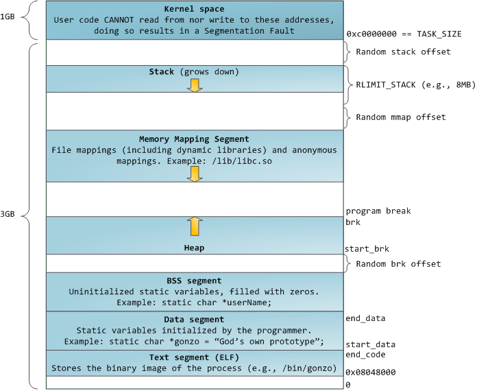

# 7.3 进程终止

```cpp
/* 注册终止处理程序 */
#include <iostream>
using namespace std;

void my_exit1() {
  cout << "first exit handler" << endl;
}

void my_exit2() {
  cout << "second exit handler" << endl;
}

int main() {
  if (atexit(my_exit2) != 0) {
    cerr << "can't register my_exit2" << endl;
    exit(0);
  }
  if (atexit(my_exit1) != 0) {
    cerr << "can't register my_exit1" << endl;
    exit(0);
  }
  if (atexit(my_exit1) != 0) {
    cerr << "can't register my_exit1" << endl;
    exit(0);
  }
  return 0;
}
```

```bash
$ ./a.out 
first exit handler
first exit handler
second exit handler
```

调用顺序和注册顺序相反。

# 7.5 环境表

ISO C 规定 main 函数只有两个参数，但大多数 UNIX 系统都支持带三个参数的 main，第三个参数为环境表地址。

```cpp
/* 打印环境变量 */
#include <iostream>
using namespace std;

extern char** environ; // 环境指针，指向环境表
int main(int argc, char* argv[], char* envp[]) {
  int n = 0;
  for (int i = 0; i < 5 && envp[i] != NULL; ++i) {
    cout << envp[i] << ", "; // (1)
  }
  cout << endl;
  for (int i = 0; i < 5; ++i) {
    cout << environ[i] << ", "; // (2)：与(1)输出相同
  }
  cout << endl;
  return 0;
}
```

# 7.7 共享库

```bash
$ gcc -static test.c # 阻止使用共享库
$ size a.out
   text    data     bss     dec     hex filename
1877407   50520   35040 1962967  1df3d7 a.out
$ gcc test.c # 默认使用共享库，编译生成的可执行文件更小
$ size a.out # 可以发现正文段、初始化数据段、未初始化数据段都更小
   text    data     bss     dec     hex filename
   2229     664     280    3173     c65 a.out
```

# 7.8 存储空间分配



```cpp
/* alloc函数通常通过sbrk系统调用实现（要求的空间大于指定值时会转用mmap实现）
 * sbrk增大program break（也是堆顶地址），并返回原program break
 * brk系统调用直接设置program break
 * 由于第一次调用printf时，堆会增长，所以将printf放在最后
 */
#include <errno.h>
#include <stdio.h>
#include <stdlib.h>
#include <string.h>
#include <unistd.h>

int bss_end;

int main() {
  void* pb1 = sbrk(0); // 堆的顶地址（此处也是堆底地址）
  sbrk(1); // 堆顶地址增加1
  void* pb2 = sbrk(0);
  char* p = (char*)malloc(1); // 会导致堆增长（>1字节）
  void* pb3 = sbrk(0);
  free(p); // 释放分配的空间，放在malloc池中而不会归还给内核（不会缩小堆）
  void* pb4 = sbrk(0);
  printf("%16s: %p\n", "bss_end", &bss_end + sizeof(bss_end)); // ≠ pb1，bss段和堆并非紧邻
  printf("%16s: %p\n", "heap start", pb1);
  printf("%16s: %p\n", "after sbrk(1)", pb2);
  printf("%16s: %p\n", "malloc(1)", p);
  printf("%16s: %p\n", "after malloc", pb3);
  printf("%16s: %p\n", "after free", pb4);

  // 验证pb1是堆的起始地址
  brk(pb1);
  void* pb5 = sbrk(0);
  brk(pb1 - 1);
  void* pb6 = sbrk(0);
  brk(pb1 + 1);
  void* pb7 = sbrk(0);
  printf("%16s: %p\n", "after brk(pb1)", pb5);
  printf("%16s: %p\n", "after brk(pb1-1)", pb6); // 不能小于pb1
  printf("%16s: %p\n", "after brk(pb1+1)", pb7); // 成功设置为pb1+1
  return 0;
}
```

```bash
$ ./a.out 
         bss_end: 0x55ea1fff4024
      heap start: 0x55ea236c7000
   after sbrk(1): 0x55ea236c7001
       malloc(1): 0x55ea236c72b0
    after malloc: 0x55ea236e9000
      after free: 0x55ea236e9000
  after brk(pb1): 0x55ea236c7000
after brk(pb1-1): 0x55ea236c7000
after brk(pb1+1): 0x55ea236c7001
```

# 7.9 环境变量

```cpp
/* 修改环境表（只影响当前进程及其子进程）
 * 由于环境表和环境字符串位于地址空间顶部，所以无法向上扩展，下方是栈，所以也无法向下扩展
 */
#include <iostream>

extern char** environ; // 环境指针，指向环境表

int main() {
  printf("%p\n", environ);
  putenv("MYENV=hello"); // 增加一项
  printf("%p\n", environ); // 由地址空间顶部移动到了堆中
  printf("%p\n", environ[0]); // 除新增的外，环境字符串仍在原地址空间顶部
}
```

```bash
$ ./a.out 
0x7ffeb5891758
0x55efe91526c0
0x7ffeb58932cf
```

