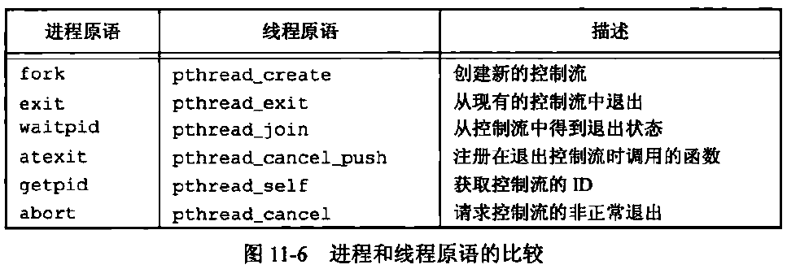

# 11.1 引言

控制线程，简称线程。

# 11.2 线程概念

典型的 UNIX 进程可以看成只有一个控制线程：一个进程在某一时刻只能做一件事。

有了多个控制线程后，在程序设计时就可以把进程设计成在某一时刻能够做不止一件事情，每个线程处理各自独立的任务。这种方法的好处在于：

- 通过为每种事件类型分配单独的处理线程，可以简化处理异步事件的代码。每个线程在进行事件处理时可以采用同步编程模式，同步编程模式要比异步编程模式简单得多。
- 多个进程必须使用操作系统提供得复杂机制才能实现内存和文件描述符的共享，而多个线程自动地可以访问相同地存储地址空间和文件描述符。
- 多个线程使得相互独立的任务可以交叉进行，从而提高整个程序的吞吐量。
- 交互的程序可以通过多线程来改善响应时间，可以将程序中处理用户输入输出的部分于其他部分分开。

- 处理器的数量不影响程序结构，所以即使在单处理器或单核系统上，也能获得多线程的好处。

每个线程都包含有表示执行环境所必需的信息，包括线程 ID、一组寄存器值、栈、调度优先级和策略、信号屏蔽字、errno 变量、线程私有数据（12.6节）。

一个进程的所有信息对其所有线程都是共享的，包括可执行程序的代码、程序的全局内存和堆内存、栈、文件描述符。

# 11.3 线程标识

进程 ID 在整个系统中是唯一的，而线程 ID 只在它所属的进程上下文中才有意义。

线程 ID 用`pthread_t`数据类型来表示的，该类型可以是整型，也可以是一个结构。

```cpp
typedef unsigned long int pthread_t; // 例如，Linux中将pthread_t定义为无符号长整型
```

因此为了保证可移植性，需要使用一个函数来比较两个进程 ID：

```cpp
#include <pthread.h>
int pthread_equal(pthread_t tid1, pthread_t tid2); // 相等返回非0数值；否则返回0
```

线程可以调用`pthread_self`函数获得自身的线程 ID：

```cpp
#include <pthread.h>
pthread_t pthread_self(void);
```

# 11.4 线程创建

```cpp
#include <pthread.h>
int pthread_create(pthread_t* restrict tidp, // 成功返回时，tidp指向新线程的ID
                  const pthread_attr_t* restrict attr, // 指定线程属性（12.3节），NULL表示默认属性
                  void* (*start_rtn)(void*), // 先线程从start_rtn函数的地址开始运行
                  void* restrict arg); // 需要传给start_rtn的参数
            // 成功返回0；否则返回错误编号
```

线程创建时并不保证时新创建的线程还是调用线程先运行。

- 因此新线程开始运行时，调用线程中`pthread_create`可能还未返回，此时`tidp`尚未指向新线程的 ID。

新创建的线程可以访问进程的地址空间，并继承调用线程的浮点环境和信号屏蔽字。

`pthread_create`函数在调用失败时通常回返回错误码，而不像其他 POSIX 函数一样设置 errno。

```cpp
#include <iostream>
#include <pthread.h>
#include <signal.h>
using namespace std;

void* thr_fn(void* arg) {
  cout << "new thread: " << "pid=" << getpid() << " tid=" << pthread_self() << endl;
  return nullptr;
}

int main() {
  pthread_t ntid;
  pthread_create(&ntid, nullptr, thr_fn, nullptr);
  cout << "main thread: " << "pid=" << getpid() << " tid=" << pthread_self() << endl;
  sleep(1); // 防止进程在新线程执行完前终止
  return 0;
}
```

# 11.5 线程终止

如果进程的任意线程调用了`exit`、`_Exit`或`_exit`，那么整个进程就会终止。

如果信号的默认动作是终止进程，那么发送到线程的信号就会终止整个进程。

线程可以通过 3 种方式退出，因此可以在不终止整个进程的情况下，停止它的控制流。

1. 从启动例程种返回，返回值是线程的退出码。
2. 被同一进程中的其他线程取消。
3. 线程调用`pthread_exit`。

```cpp
#include<pthread.h>
void pthread_exit(void* rval_ptr);
```

`rval_ptr`作为线程的返回状态，可以被其他线程调用`pthread_join`来获取

```cpp
#include<pthread.h>
int pthread_join(pthread_t thread, void** rval_ptr); // 成功返回0；否则返回错误编号
```

调用`pthread_join`的线程将一直阻塞，直至指定的线程调用`pthread_exit`从启动例程中返回或者被取消。

- 如果目标线程正常返回，则`rval_ptr`指向该线程的返回码。
- 如果线程被取消，则`rval_ptr`指向的内存单元被设置为`PTHREAD_CANCELED`。

可以通过调用`pthread_join`自动把目标线程置于分离状态。如果线程已经处于分离状态，`pthread_join`调用就会失败，返回`EINVAL`。

如果对线程的返回值不感兴趣，可以把`rval_ptr`设置为`NULL`。

```cpp
#include <iostream>
#include <pthread.h>
#include <signal.h>
using namespace std;

void* thr_fn1(void* arg) {
  cout << "thread1 returning" << endl;
  return ((void*)1);
}

void* thr_fn2(void* arg) {
  cout << "thread2 exiting" << endl;
  return ((void*)2);
}

int main() {
  pthread_t tid;
  void* trval;
  int err;
  if (err = pthread_create(&tid, nullptr, thr_fn1, nullptr)) {
    cerr << err << ", can't create thread 1" << endl;
    exit(1);
  }
  if (err = pthread_join(tid, &trval)) {
    cerr << err << ", can't join with thread 1" << endl;
    exit(1);
  }
  cout << "thread 1 exited, tid=" << tid << ", code=" << (long)trval << endl;

  if (err = pthread_create(&tid, nullptr, thr_fn2, nullptr)) {
    cerr << err << ", can't create thread 2" << endl;
    exit(1);
  }
  if (err = pthread_join(tid, &trval)) {
    cerr << err << ", can't join with thread 2" << endl;
    exit(1);
  }
  cout << "thread 2 exited, tid=" << tid << ", code=" << (long)trval << endl;
  return 0;
}
```

`pthread_create`和`pthread_exit`函数的无类型指针可以指向一个结构体，要保证这个结构体所使用的内存在调用线程完成调用后仍然是有效的。不要在线程私有的栈尚分配该结构。

## pthread_cancel

线程可以通过调用`pthread_cancel`函数来请求取消同一进程中的其他线程。

```cpp
#include <pthread.h>
int pthread_cancel(pthread_t tid); // 成功返回0；否则返回错误编号
```

默认情况下，该函数会使得由`tid`标识的线程的行为标签为如同调用了参数为`PTHREAD_CANCELED`的`pthread_exit`函数。

```cpp
#define PTHREAD_CANCELED ((void *) -1)
```

但是线程可以选择忽略取消或控制如何被取消。

`pthread_cancel`并不等待线程终止，它仅仅提出请求。（12.7节）

## 清理处理程序

线程可以设置退出时需要调用的函数，这样的函数被称为线程清理处理程序（thread cleanup handler）。一个线程可以建立多个清理处理程序，处理程序记录在栈中，执行顺序与注册时相反。

```cpp
#include <pthread.h>
void pthread_cleanup_push(void (*rtn)(void*), void* arg);
void pthread_cleanup_pop(int execute);
```

当线程执行以下动作时，清理函数`rtn`会被使用参数`arg`进行调用：

- 调用`pthread_exit`时。
- 响应取消请求时。
- 用非零`execute`参数调用`pthread_cleanup_pop`时。

若`execute`参数设置为 0，清理函数将不被调用。不管`execute`参数是否为 0，`pthread_cleanup_pop`都将删除上次`pthread_cleanup_push`调用建立的清理处理程序。

注意：这两个函数可以被实现为宏，可以包含`{}`字符，因此必须在与线程相同的作用域中以匹配对的形式使用。

## 与进程函数的比较



## pthread_detach

默认情况下，线程的终止状态回保存知道对该线程调用`pthread_join`。若线程已被分离，线程的底层存储资源可以在线程终止时立即被收回。对分离状态的线程调用`pthread_join`会产生未定义行为。可以调用`pthread_detach`分离线程。

```cpp
#include <pthread.h>
int pthread_detach(pthread_t tid); // 成功返回0；否则返回错误编号
```

# 11.6 线程同步

当多个控制线程共享相同的内存时，需要确保每个线程看到一致的数据视图。

当一个线程可以修改的变量，其他线程也可以读取或修改时，就需要对这些线程进程同步。

当一个线程的写操作耗时多于一个存储器访问周期时，其他线程在读取这个变量时可能会看到一个不一致的值。

两个或多个线程试图在同一时间修改同一变量时，也需要进程同步。例如对于增量操作，通常分解为以下三步：

1. 从内存单元读入寄存器。
2. 在寄存器中对变量做增量操作。
3. 把新的值写回内存单元。

如果两个线程几乎在同一时间对同一个变量做增量操作而不进行同步的话，结果可能出现不一致——变量可能增加了 1，也可能增加了 2。

## 11.6.1 互斥量

互斥量用于确定同一时间只有一个线程访问数据。

互斥量（mutex）从本质上来说是一把锁，在访问共享资源前对互斥量进行设置（加锁），在访问完成后释放（解锁）互斥量。

对互斥量加锁后，任何其他试图再次对互斥量加锁的线程都会被阻塞，直到当前线程释放该互斥锁。

如果释放互斥量时有一个以上的线程阻塞，那么所有这些线程都会变成可运行状态，第一个变为运行的线程就可以对互斥量加锁，其他线程看到互斥量依然是锁着的，只能再次阻塞。

互斥变量是用`pthread_mutex_t`数据类型表示的。在使用互斥变量前，必须首先对其进行初始化。

- 可以设置为常量`PTHREAD_MUTEX_INITIALIZER`（只适用于静态分配的互斥量）。
- 也可以通过调用`pthread_mutex_init`函数进行初始化。

如果动态分配互斥量（如调用`malloc`函数），在释放内存前要先调用`pthread_mutex_destory`。

```cpp
#include <pthread.h>
int pthread_mutex_init(pthread_mutex_t* restrict mutex,
                      const pthread_mutexattr_t* restrict attr);
int pthread_mutex_destory(pthread_mutex_t* mutex);
                           // 两个函数返回值：成功返回0；否则返回错误编号
```

`attr`设置为`NULL`表示使用默认属性进行初始化。（12.4节）

对互斥量进行加锁，需要调用`pthread_mutex_lock`，如果互斥量已经u上锁，调用线程将阻塞直至互斥量被解锁。对互斥量解锁需要调用`pthread_mutex_unlock`。

```cpp
int pthread_mutex_lock(pthread_mutex_t* mutex);
int pthread_mutex_trylock(pthread_mutex_t* mutex);
int pthread_mutex_unlock(pthread_mutex_t* mutex);
                  // 三个函数的返回值：成功返回0；否则返回错误编号
```

`pthread_mutex_trylock`尝试对互斥量加锁，若互斥量处于未加锁状态，则锁住互斥量，返回 0；否则函数会失败，返回`EBUSY`，且线程不会阻塞。

## 11.6.2 避免死锁

**发生死锁**

- 如果线程试图对同一个互斥量加锁两次，则它自身就会陷入死锁状态。
- 程序使用一个以上的互斥量，两个线程相互请求另一个线程拥有的资源时，会发生死锁。

**解决方案**

1. 仔细控制互斥量加锁的顺序。例如需要对 A 和 B 同时加锁时，总是先锁 A 再锁 B。
2. 使用`pthread_mutex_trylock`函数避免死锁，如果不能获取锁，则先释放已占有的锁，做好清理工作，然后过一段时间再重试。

## 11.6.6 条件变量

```cpp
/* 主线程从标准输入接收字符串并放入消息队列，
 * 两个线程从队列中取出消息并打印。
 */
#include <iostream>
#include <pthread.h>
#include <queue>
#include <unistd.h>
using namespace std;

queue<string> qmsg; // 消息队列
pthread_mutex_t qlock;
pthread_cond_t qready;

void* thr_fn(void* arg) { // 从队列中取出一条消息并处理
  string msg;
  while (true) {
    pthread_mutex_lock(&qlock);
    while (qmsg.empty()) pthread_cond_wait(&qready, &qlock); // 队列不为空则不等待通知（即错过通知也不会阻塞）
    msg = qmsg.front();
    qmsg.pop();
    pthread_mutex_unlock(&qlock);
    sleep(3); // 模拟处理耗时，此时可能会丢失来自主线程的通知
    cout << "thread " << pthread_self() << " processed: " << msg << endl;
  }
  return ((void*)0);
}

int main() {
  pthread_mutex_init(&qlock, NULL);
  pthread_cond_init(&qready, NULL);
  pthread_t tid1, tid2;
  pthread_create(&tid1, NULL, thr_fn, NULL);
  pthread_create(&tid2, NULL, thr_fn, NULL);
  string msg;
  while (cin >> msg) {
    if (msg == "q") break;
    pthread_mutex_lock(&qlock);
    qmsg.emplace(msg);
    pthread_mutex_unlock(&qlock);
    pthread_cond_signal(&qready); // 通知在等待的某一线程
    // pthread_cond_broadcast(&qready);
  }
  return 0;
}
```


