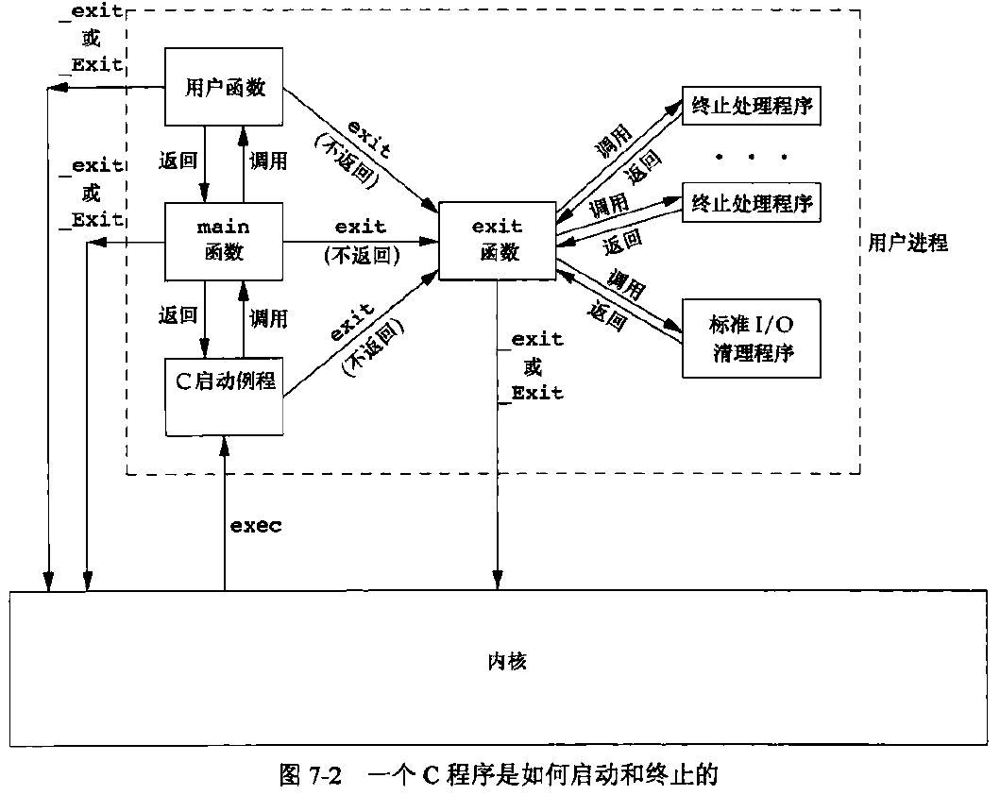
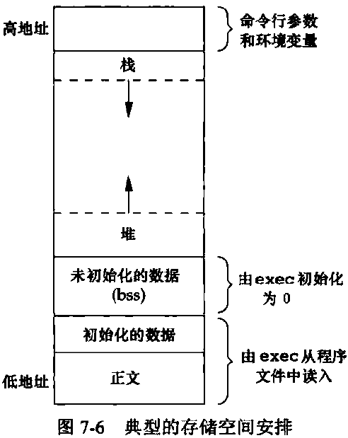
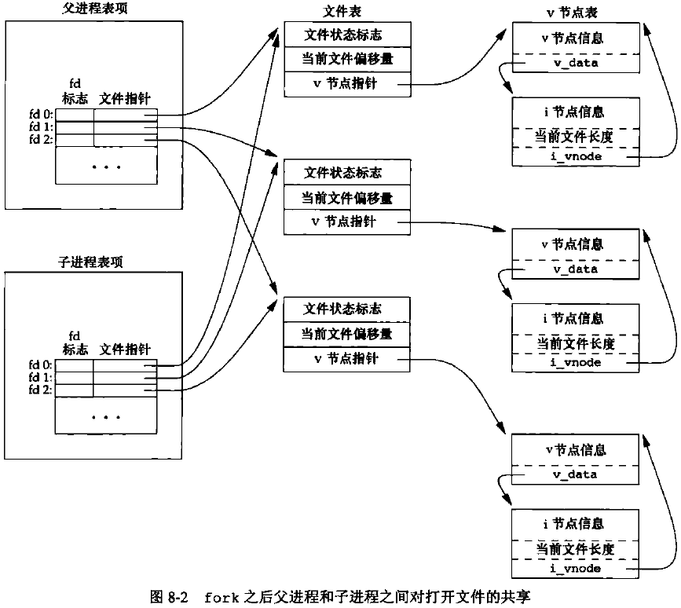

# 说明

内容来自网络、chatgpt、claude等。

# 1. 错误检查

## 1.1 调用无出错返回的函数中如果发生出错，应该怎么办？

例如：使用`fwide`函数修改一个无效的流的定向时。

检查`errno`。

# 2. I/O 缓冲

## 2.1. 带缓冲 I/O 和不带缓冲 I/O

所谓不带缓冲，并不是指内核不提供缓冲，而是指进程不提供缓冲。

`read`和`write`是不带缓冲 I/O，每一次调用都会调用一次系统调用，但这不意味着真的没有任何缓冲（还有内核缓冲）。

## 2.2. 磁盘 I/O

1. 如`read`的时候，大多数的文件系统为提高性能都采用某种预读(read ahead)技术, 当检测到正在进行顺序读取时，系统就试图读入比应用所要求的更多数据.
2. 通常`write`只是将数据排入队列，而实际的写磁盘操作则可能在以后的某个时刻进行。 而数据库系统则需要使用`O_SYNC`，这样一来当它从`write`返回时就知道数据已确实写到磁盘上， 以免在系统异常是产生数据丢失。

所有磁盘 I/O 都要经过内核的块缓冲区（也称为内核的缓冲区高速缓存）。唯一例外的是对原始磁盘设备的 I/O ，但是我们不考虑这种情况。既然 read 或 write 的数据都要被内核缓冲，那么术语“不带缓冲的 I/O ”指的是在用户的进程中对这两个函数不会自动缓冲，每次 read 或 write 就要进行一次系统调用。

## 2.3. 标准 I/O

标准 I/O 对流进行操作，提供了以下3种缓冲：

1. 全缓冲

   在填满标准 I/O 缓冲区后才进行实际 I/O 操作。

   对驻留在磁盘上的文件的 I/O 通常是全缓冲。

   在一个流上执行第一次 I/O 操作时，相关标准 I/O 函数通常调用`malloc`获得需要使用的缓冲区。

2. 行缓冲

   当在输入和输出中遇到换行符时，标准 I/O 库执行 I/O 操作。

   终端的输入输出（如标准输入`stdin`，标准输出`stdout`）通常是行缓冲。

   行缓冲有两个限制：

   - 只要缓冲区满，即使没有遇到换行符，也会进行 I/O 操作。

   - 任何时候只要通过标准 I/O 库从（a）一个不带缓冲的流或者（b）一个行缓冲的流（且需要从内核获得数据）得到输入数据，那么就会冲洗所有行缓冲输出流。

     情况（a）肯定需要从内核获得数据；情况（b）只有当缓冲区内没有所需数据时才需要从内核获得数据。

3. 不带缓冲

   不对字符进行缓冲，立即进行 I/O 操作。

   标准错误流（stderr）通常是不带缓冲的。

```cpp
#include <iostream>
#include <unistd.h>

using namespace std;

int main() {
  cout << "无换行符，不会立刻输出";
  sleep(3);
  fflush(NULL); // 冲洗所有输出流
  return 0;
}
```

- 缓冲区可由标准 I/O 例程自动冲洗（例如当缓冲区满时），或者可以调用`fflush`冲洗一个流。`fflush(NULL)`冲洗所有输出流。
- 可以使用`setbuf`和`setvbuf`函数修改流的缓冲类型。
- 某些实现会将缓冲区的一部分用于存放自己的操作管理信息，所以可存放的实际数据字节数可能少于设定值。
- 除非流引用终端设备，否则按系统默认，流被打开时是全缓冲的。若流引用终端设备，则该流是行缓冲的。
- 调用`fclose`关闭一个打开的流。在文件被关闭前，会冲洗缓冲区中的输出数据，丢弃输入数据。若缓冲区由标准I/O库自动分配的，则释放该缓冲区。
- 进程正常终止时（调用`exit`函数或从`main`返回），对所有打开的标准I/O流调用`fclose`。


# 3. 进程启动和终止

## 3.1 进程运行过程



当内核执行 C 程序时（使用某一个`exec`函数），在调用`main`之前会先调用一个特殊的启动例程。可执行程序文件将此启动例程指定为程序的起始地址——这是由连接编辑器设置的，而连接编辑器则由 C 编译器调用。

启动例程从内核取得命令行参数和环境变量值，为调用`main`函数做好准备。

启动例程在从`main`返回后立即调用`exit`函数，形式类似于：`exit(main(argc, argv));`。

3个`exit`函数的参数将作为进程的终止状态。c99标准后，若main的返回类型是整型，且为隐式返回（不写`return`语句），则该进程的终止状态为0（C99前返回值不确定）。可通过`echo $?`打印上一个进程的终止状态。

## 3.2 进程终止方式

有8种方式使进程终止（termination），其中5种为正常终止：

1. 从 `main` 返回
2. 调用 `exit`
   - 先调用已注册的终止处理程序，然后对所有打开的流调用`fclose`（这会导致输出缓冲区中的所有数据都被冲洗），最后调用`_exit`。
   - 注意：`exit`大多数现代实现不再关闭流，因为进程即将终止，内核将关闭进程中已打开的所有文件描述符，在库中关闭只增加了开销而没有任何益处。
3. 调用 `_exit` 或 `_Exit`。
   - 立即进入内核。
   - 在`UNIX`系统中，`_Exit`和`_exit`同义。
4. 最后一个线程从其启动例程返回。
   - 注意，进程的终止状态为 0，与线程的返回值无关。
5. 从最后一个线程调用 `pthread_exit`。
   - 同 4，进程的终止状态为 0，与线程的返回值无关。

有3种为异常终止：

1. 调用 `abort`。它产生`SIGABRT`信号，这是 2 的一种特例。
2. 收到某些信号，如`SIGABRT`、引用地址空间外的存储单元、除以 0 等。
3. 最后一个线程对取消请求做出响应。默认情况下，“取消”以延迟方式发生：一个线程要求取消另一个线程，若干时间后，目标线程终止。

不管进程如何终止，最后都会执行内核中的同一段代码，这段代码为相应进程关闭所有打开的描述符，释放它所使用的存储空间等。

子进程调用终止函数（`exit`、` _exit`、` _Exit`）时，可以将其**退出状态**作为参数传给函数，调用`_exit`时，内核将**退出状态**转换为**终止状态**。

在异常终止时，内核（而非进程本身）产生一个指示其异常原因的终止状态。

子进程终止时，父进程能用 wait 或 waitpid 函数取得其**终止状态**。

若父进程在子进程之前终止，则子进程的父进程会变为 init 进程，这一过程称为被 init 进程收养。其操作过程大致是：当一个进程终止时，内核逐个检查所有活动进程，以判断它是否是正要终止进程的子进程，如果是，则将其父进程 ID 改为 1（init 进程的 ID）。

若子进程在父进程之前终止，内核会为每个终止子进程保存一定量的信息，至少包括进程 ID、进程终止状态、进程使用的 CPU 时间总量等。父进程在调用 wait 或 waitpid 时能够得到这些信息。

一个已经终止，但是父进程尚未对其进行善后处理（获取终止子进程的有关信息，释放它仍占用的资源）的进程被称为僵死进程。

被 init 收养的进程不会变为僵死进程，因为 init 只要有一个子进程终止，就会调用一个 wait 函数取得其终止状态。

# 4. 程序的存储空间布局



1. 正文段。包含由 CPU 执行的机器指令。通常正文段是只读的、可共享的。

2. 初始化数据段。又称数据段。包含了程序中需要明确赋初值的变量。例如已初始化的全局变量。

3. 未初始化数据段。又称 bss 段（block started by symbol）。在程序开始执行之前，内核将此段中的数据初始化为0或空指针。未初始化的全局变量存放在此段。

4. 栈。自动变量以及每次函数调用时需要保存的信息都存放在此段中。

   每次函数调用时，其返回地址和调用者的环境信息（如某些寄存器的值）都存放在栈中，然后，最近被调用的函数在栈上为其自动和临时变量分配存储空间。递归函数每次调用自身时，会使用一个新的栈帧，因此一次函数调用实例中的变量集不会影响另一次函数调用实例中的变量。

5. 堆。通常在堆中进行动态存储分配。

从图7-6中可以看出，需要存放在磁盘文件中的段只有正文段和初始化数据段，未初始化数据段由内核在运行前置为0。

```bash
# 可以通过size命令查看正文段、数据段、bss段的长度（字节）
$ size /usr/bin/cc /bin/sh
   text    data     bss     dec     hex filename
 907889    9528   14224  931641   e3739 /usr/bin/cc
 112884    4888   11424  129196   1f8ac /bin/sh
```

# 5. 进程

## 5.1 进程 ID

每个进程都有一个非负整型表示的唯一进程 ID。

进程终止后，其 ID 是可被未来的进程复用的。

系统中有一些专用进程：

- ID 为 0 的进程通常是调度进程，常被称为交换进程（swapper）。它是内核的一部分，不执行任何磁盘上的程序，因此也被称为系统进程。

- ID 为 1 的进程通常是 init 进程，在自举过程（加电自检和磁盘引导）结束后由内核调用。init 进程决不会终止。它是一个普通的用户进程（不是内核中的系统进程），但是它以超级用户特权运行。

  init 通常读取与系统有关的初始化文件，并将系统引导到一个状态（如多用户）。

# 6. fork

`fork`函数创建一个子进程。

`fork`函数调用一次，但返回两次，在子进程中返回0，在父进程中返回子进程 ID。

子进程会获得父进程数据空间、堆、栈的副本（而非共享），父子进程共享正文段（.text）。

由于 fork 之后经常跟随着 exec（会替换当前程序，但不创建新进程），所以很多实现并不会产生父进程数据段、堆、栈的完全副本，而是使用写时复制（Copy-On-Write）技术。这些区域由父子进程共享，内核会将它们的访问权限改变为只读，如果父子进程中的任一个视图修改这些区域，则内核只为被修改区域的内存创建一个副本，通常是虚拟存储系统中的“一页”。

在 fork 之后父进程先执行还是子进程先执行是不确定的。

## 6.1 文件描述符



在 fork 一个子进程时，父进程所有打开的文件描述符也被复制到子进程中。因此若父进程的标准输出已被重定向到文件，则子进程的标准输出也是重定向的状态，且与父进程共享文件偏移量。

如果父子进程写同一描述符指向的文件，但又没有任何形式的同步，它们的输出就会相互混合。

fork 失败的主要原因有：（1）系统中已有太多进程。（2）该实际用户 ID 的进程总数超过了系统限制。

## 6.2 锁

`fork`创建的子进程将复制父进程的整个地址空间（写时复制），继承了父进程的互斥量、读写锁和条件变量的状态。

- 父进程中被占有的锁在子进程中也是被占用状态。
- 子进程不会继承父进程设置的记录锁。记录锁是针对文件的，也不应该继承。

新创建的子进程中只存在一个线程——父进程中调用`fork`的线程的副本。

- 因此如果父进程中锁被其他线程占用，子进程无法得知自己占有了哪些锁，需要释放哪些锁。
- 解决方案是通过`pthread_atfork`函数安装3个帮助清理锁的函数。
  - `prepare`函数确保在父进程中获取到锁。
  - `parent`函数和`child`函数分别在父进程和子进程中对这些锁进行释放（fork创建子进程后，返回之前）。

# 7. exec

有 7 种不同的 exec 函数。当进程调用一种 exec 函数时，该进程执行的程序完全替换为新程序，而新程序则从其 main 开始执行。exec 并不创建新进程，调用前后的进程 ID 并未改变。exec 只是用磁盘上的一个新程序替换了当前进程的正文段、数据段、堆段和栈段。

对打开文件的处理与每个描述符的执行时关闭（close-on-exec）标志值（FD_CLOEXEC）有关。若设置了此标志（可通过 fcntl 函数设置），则在执行 exec 时关闭该描述符，否则该描述符仍打开。

# 8. 信号

信号是软件中断。

不存在编号为 0 的信号。

信号是异步事件，产生信号的事件对进程而言是随机出现的。

在某个信号出现时，可以告诉内核按下列 3 种方式之一进行处理：

1. 忽略信号。无法忽略 SIGKILL 和 SIGSTOP。
2. 捕捉信号。通知内核在某种信号发生时，调用一个用户函数。不能捕捉 SIGKILL 和 SIGSTOP。
3. 执行系统默认动作。注意，大多数信号的系统默认动作是终止该进程。

## 8.1 exec

exec 函数将原先设置为要捕捉的信号都更改为默认动作，其他信号则不变（即忽略的仍然被忽略）。（这是因为执行新程序后，信号捕捉函数的地址对新程序已无意义）

## 8.2 fork

当一个进程调用 fork 时，其子进程继承父进程的信号处理方式。因为子进程在开始时复制了父进程内存映像，所以信号捕捉函数的地址在子进程种是有意义的。

## 8.3 信号递送和未决

当造成信号的事件发生时，为进程**产生**一个信号（或向一个进程发送一个信号）。当一个信号产生时，内核通常在进程表中以某种形式设置一个标志。当对信号采取这种动作时，称为向进程**递送**了一个信号。

在信号**产生（generation）**和**递送（delivery）**之间的时间间隔内，称信号是**未决的（pending）**。

进程可以选择**阻塞**信号递送，如果为进程产生了一个被阻塞的信号，且对该信号的动作是系统默认或捕捉，则为该进程将此信号保持为未决状态，直至该进程对此信号解除阻塞或将对此信号的动作更改为忽略。

内核在递送一个原来被阻塞的信号给进程时（而不是在产生信号时），才决定对它的处理方式，因此进程在此之前仍可以改变对该信号的动作。

如果再解除阻塞前该信号发生了多次，不同系统可能会递送该信号一次或多次。

如果有多个信号要递送给一个进程，递送顺序没有明确规定。

## 8.4 发送信号

```cpp
#include <signal.h>
int kill(pid_t pid, int signo); // 向进程 pid 发送信号
int raise(signo); // 向自身发送信号
                            // 两个函数返回值：成功0；出错-1
```

编号为 0 的信号被定义为空信号，`kill(pid, 0)`并不真的发送信号，但会执行正常的错误检查，可以用来确定特定进程是否仍然存在，如果向一个不存在的进程发送空信号，`kill`返回`-1`，`errno`被设置为`ESRCH`。

# 9. 可重入、异步信号安全和线程安全

## 可重入函数
可以被中断的函数，即在函数执行的任意时刻中断，执行另一段代码，返回时不会出现错误。

可重入函数不能含有静态（全局）非常量数据。

函数不可重入的原因：

1. 使用了静态数据结构。
2. 调用了`malloc`或`free`。
3. 是标准 I/O 函数。

## 异步信号安全函数

与可重入函数同义，其在信号处理程序中保证调用安全。

由于每个**线程**只有一个 errno，即使信号处理程序调用的是可重入函数，也可能会修改 errno，因此应当在调用前保存 errno，在调用后回复 errno。

## 线程安全函数

如果一个函数在相同时间点可以被多个线程安全地调用，则称该函数是**线程安全**的。

可重入函数是线程安全的，但线程安全函数不一定是可重入的。 

使用`sigwait`可以将异步产生的信号用同步的方式处理。即使用专用线程来处理信号，而非通过信号处理程序，这样就不用考虑异步信号安全问题。

# 条件变量为什么要和互斥锁一起使用

https://blog.csdn.net/yizhiniu_xuyw/article/details/109635912

# 用户抢占和内核抢占，非抢占式和可抢占式内核

https://blog.csdn.net/Rong_Toa/article/details/114496009

# 线程栈的位置

线程栈位于进程的虚拟地址空间中，但它既不属于堆区，也不属于通常意义上的“进程栈区”。具体来说，线程栈是在线程创建时由操作系统分配的一段内存空间，位于进程的虚拟地址空间中的一个独立区域。

## 内存布局示意

典型的进程虚拟内存布局可以如下示意：

- **代码段**：存放可执行代码

- **数据段**：存放已初始化的全局变量和静态变量

- **BSS段**：存放未初始化的全局变量和静态变量

- **堆区**：动态内存分配区域，由 `malloc`、`calloc`、`realloc` 等函数管理，从低地址向高地址增长

- 栈区

  ：存放函数调用的局部变量、返回地址等，从高地址向低地址增长

  - **主线程栈**：进程启动时的初始栈
  - **其他线程栈**：每个新线程创建时分配的栈

- **内存映射区**：存放动态链接库和内存映射文件等

## 线程栈位置

1. **主线程栈**：这是进程启动时由操作系统为主线程分配的栈，通常位于高地址区，从高地址向低地址增长。我们通常称这个区域为“栈区”。
2. **其他线程栈**：每个新线程创建时，操作系统会为其分配一个新的栈。这个栈也是在进程的虚拟地址空间中分配的，但它不是在“堆区”内，而是分配在一个独立的区域。这些线程栈通常也位于高地址区，靠近主线程栈区域，但具体位置由操作系统决定。

## 内存布局细节

- **进程的虚拟地址空间**：操作系统为每个进程分配一个虚拟地址空间，这个空间是进程独有的。
- **栈的独立性**：每个线程的栈都是独立的，并且从高地址向低地址增长。
- **操作系统管理**：操作系统负责管理线程栈的分配和释放。

# 线程栈和进程栈的区别

## 1. 定义和用途

- **线程栈**：每个线程有自己独立的栈，用于存储线程执行过程中的局部变量、函数调用信息、返回地址等。线程栈是线程私有的，线程间不能直接访问彼此的栈。
- **进程栈**：通常指的是进程的主线程（主函数）的栈。每个进程在其创建时都会有一个主线程，该线程的栈通常被称为进程栈。

## 2. 独立性和共享性

- **线程栈**：线程栈是独立的，每个线程都有自己的栈。这使得每个线程可以独立执行，不会干扰其他线程的栈内容。即使在同一个进程内，线程栈也是相互隔离的。
- **进程栈**：进程栈是特定于进程的主线程的栈。当进程启动时，操作系统会为其主线程分配一个栈空间。

## 3. 内存布局

- **线程栈**：线程栈是在进程的虚拟地址空间内分配的，每个线程有自己的栈空间。多个线程共享进程的堆和全局变量，但它们各自有独立的栈。
- **进程栈**：进程栈通常是指进程的主线程的栈，它在进程的虚拟地址空间中独占一部分。这个栈从高地址向低地址增长。

## 4. 创建和管理

- **线程栈**：在线程创建时由线程库（如Pthreads或Windows线程库）分配，栈的大小可以在创建线程时指定。每个线程终止时，线程栈会被释放。
- **进程栈**：在进程创建时由操作系统分配，通常在进程终止时释放。进程栈的大小也可以通过编译和链接时的选项进行配置。

## 5. 保护机制

- **线程栈**：操作系统通常在每个线程栈的末尾设置保护页，以捕捉栈溢出并引发异常。
- **进程栈**：同样，进程栈也会有保护页机制，以防止栈溢出和潜在的内存覆盖。

## 6. 调整方式

- **线程栈**：可以通过线程库的接口在创建线程时指定栈大小，如Pthreads的 `pthread_attr_setstacksize` 函数。
- **进程栈**：可以在编译时通过编译器选项设置，例如使用 `-Wl,-stack_size` 选项来设置栈大小，或者通过操作系统的配置文件和环境变量来调整。

## 7. 作用范围

- **线程栈**：作用于单个线程，在多线程应用中，每个线程都依赖自己的栈来保持其独立运行状态。
- **进程栈**：作用于整个进程的主线程，是进程启动后的第一个执行栈，主要用于主线程的执行。

## 8. 性能影响

- **线程栈**：由于每个线程有独立的栈，线程的上下文切换和栈操作相对独立，不影响其他线程。
- **进程栈**：进程的主线程的栈对于整个进程的启动和主线程的执行至关重要，影响进程的整体性能。

# malloc 是线程安全的吗？

不是。

# 线程

线程有独立的`errno`和独立的信号屏蔽字。

闹钟定时器是进程资源，并且所有线程共享相同的闹钟。所以进程中的多个线程不可能互不干扰（或互不合作）地使用闹钟定时器。

# 多线程环境下的函数

## IO 函数

所有线程共享相同的文件描述符

```cpp
pread(); // 设置偏移量和读操作是一个原子操作
pwrite(); // 设置偏移量和写操作是一个原子操作
```


# 文件和记录锁

更合适的表述是“字节范围锁”，用于对文件的一个区域或整个文件进行加锁。

通过`fcntl`函数可以加共享读锁、独占性写锁或解锁某个区域。

可能出现死锁。

守护进程可以通过文件锁（对整个文件区域加记录锁）来保证只有该守护进程的唯一副本在运行。

## 记录锁的隐含继承和释放

1. 锁与进程和文件两者相关联。
   - 当进程终止时，其建立的锁全部释放。
   - 当文件描述符关闭时，该文件描述符引用的文件上的任何一把由**该进程**设置的锁都会释放。
     - 通过`open`、`dup`、`fork`得到的文件描述符若引用同一文件，则只要其中一个被关闭，锁就会被释放。
2. 由`fork`产生的子进程不继承父进程设置的锁。
3. 在执行exec后，新程序可以继承原程序的锁。但是若对文件描述符设置了执行时关闭标志，则exec在关闭该文件描述符时，对应文件上的锁也会被释放。

# 文件描述符、文件指针、文件流

# 守护进程

# 轮询

# 存储映射I/O

存储映射I/O（memory-mapper I/O）将一个磁盘文件映射到存储空间中的一个缓冲区上，从缓冲区中取/存数据时，相当于读/写文件的相应字节。

通过`mmap`函数进行映射。

# 内核缓冲区和用户缓冲区
