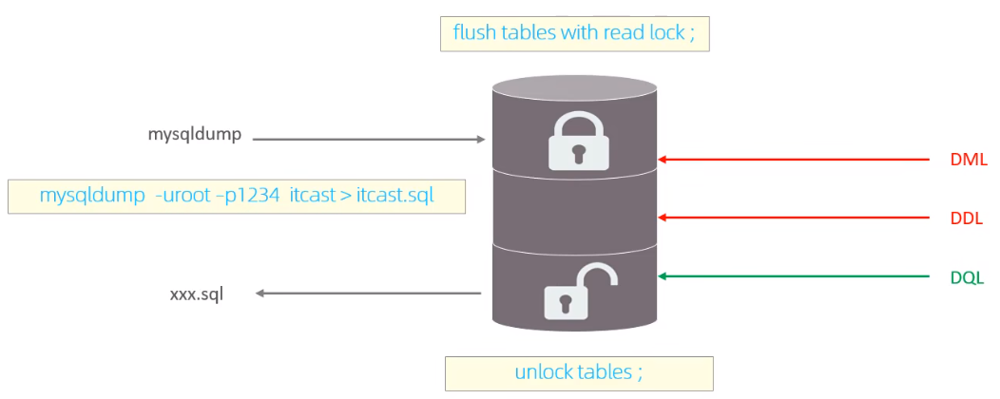

# 基本概念

| 类别   | 说明               |
| ------ | ------------------ |
| 全局锁 | 锁住数据库中所有表 |
| 表级锁 | 锁住整张表         |
| 行级锁 | 锁住操作的行       |

# 全局锁 

对整个数据库实例加锁，加锁后整个实例只读，后续的会产生修改的语句、包含修改的事务的提交语句会被阻塞。



- `mysqldump`在命令行中执行（而非mysql中），用于备份数据库

## 全局锁的特点

1. 如果在主库上备份，那么在备份期间都不能执行更新，业务基本上就得停摆。

2. 如果在从库上备份，那么在备份期间从库不能执行主库同步过来的二进制日志（binlog），会导致主从延迟。

3. 在InnoDB引擎中，可以在备份时加上参数`--single-transaction`参数来完成不加锁的一致性数据备份。

# 表级锁

锁定整张表。

主要分为3类：表锁，元数据锁（meta data lock, MDL），意向锁（Intention Locks）。

## 表锁

1. 表共享读锁（read lock）：所有客户端都只能读。
2. 表独占写锁（write lock）：加锁的客户端可以读写，其他客户端只能读。

```mysql
LOCK TABLES 表1[ 表2]... {READ|WRITE}; # 注意多个表之间用空格隔开，不要用逗号
UNLOCK TABLES;  # 释放锁，客户端断开连接也会自动释放
```

## 元数据锁

MDL加锁过程是系统自动控制，无需显式使用，在访问一张表的时候会自动加上。MDL锁主要作用是维护表元数据的数据一致性，在表上有活动事务的时候，不可以对元数据进行写入操作。为了避免DML与DDL冲突，保证读写的正确性。

| 对应SQL                                       | 锁类型                                  |
| --------------------------------------------- | --------------------------------------- |
| lock tables xxx read/write                    | SHARED_READ_ONLY / SHARED_NO_READ_WRITE |
| select、select ... lock in share mode         | SHARED_READ                             |
| insert、update、delete、select ... for update | SHARED_WRITE                            |
| alter table ...                               | EXCLUSIVE                               |

- SHARED_READ和SHARED_WRITE兼容，二者均和EXCLUSIVE互斥。

查看元数据锁和表锁

```mysql
SELECT object_type,object_schema,object_name,lock_type,lock_duration FROM performance_schema.metadata_locks;
```

## 意向锁

为了避免DML在执行时，加的行锁与表锁的冲突，在InnoDB中引入了意向锁，使得表锁不用检查每行数据是否加锁，使用意向锁来减少表锁的检查。意向锁也是自动添加和释放的。

1. 意向共享锁（IS）：由语句 select ... lock in share mode 添加。
   - 与表锁共享锁（read）兼容，与表锁排他锁（write）互斥。
2. 意向排他锁（IX）：由 insert、update、delete、select ... for update 添加。
   - 与表锁共享锁（read）和表锁排他锁（write）均互斥。意向锁之间不会互斥。

查看意向锁和行级锁

```mysql
SELECT object_schema,object_name,lock_type,lock_mode,lock_data FROM performance_schema.data_locks;
```

# 行级锁

锁住对应的行数据。应用在InnoDB存储引擎中。

InnoDB的数据是基于索引组织的，行锁是通过对索引上的索引项加锁来实现的，而不是对记录加的锁。

对于行级锁，主要分为以下三类：

1. 记录锁（Record Lock）（也叫行锁）：锁定单行记录，防止其他事务对其进行 update 和 delete。在RC、RR隔离级别下都支持。
2. 间隙锁（Gap Lock）：锁定索引记录间隙，防止其他事务在这个间隙进行 insert，产生幻读。在RR隔离级别下支持。
3. 临键锁（Next-Key Lock）：行锁和间隙锁的结合，同时锁住数据和数据**前面**的间隙。在RR隔离级别下支持。

```mysql
# 查看意向锁和行级锁
SELECT object_schema,object_name,lock_type,lock_mode,lock_data FROM performance_schema.data_locks;
```


## 记录锁

InnoDB实现了以下两种类型的记录锁：

1. 共享锁（S）：允许当前事务去读一行，阻止其他事务获得相同数据的排它锁（可读不可写）。
2. 排他锁（X）：：允许获取当前事务更新数据，阻止其他事务获得相同数据的共享锁和排他锁（禁止读写）。

- 即：共享锁和共享锁之间兼容，共享锁和排他锁、排他锁和排他锁之间不兼容。

| SQL                           | 行锁类型 | 说明                             |
| ----------------------------- | -------- | -------------------------------- |
| INSERT                        | 排他锁   | 自动加锁                         |
| UPDATE                        | 排他锁   | 自动加锁                         |
| DELETE                        | 排他锁   | 自动加锁                         |
| SELECT                        | 不加锁   |                                  |
| SELECT ... LOCK IN SHARE MODE | 共享锁   | 通过 LOCK IN SHARE MODE 手动加锁 |
| SELECT ... FOR UPDATE         | 排他锁   | 通过 FOR UPDATE 手动加锁         |

默认情况下，InnoDB 在 REPEATABLE READ 事务隔离级别运行，InnoDB 使用 **next-key 锁**进行搜索和索引扫描，以防止幻读。

1. 唯一索引上的等值查询，当记录存在时，退化为记录锁。
2. InnoDB 的记录锁是针对于索引加的锁，不通过**索引**检索数据时，InnoDB将对表中的所有记录（每一行）加锁，此时 就会升级为“表锁”（与使用`LOCK TABLES`创建的表锁不是一个东西）。
   - 为每一行加记录锁
   - 并添加一个上限无穷的间隙锁

## 间隙锁/临键锁

默认情况下，InnoDB 在 REPEATABLE READ 事务隔离级别运行，InnoDB 使用 **next-key 锁**进行搜索和索引扫描，以防止幻读。

1. 等值查询，被查询的数据存在时

   - 唯一索引：临键锁退化为记录锁。

   - 非唯一索引：不退化，且会在第一个不匹配的索引项前加间隙锁。

2. 等值查询，被查询的数据不存在时

   - 对于唯一索引和非唯一索引，临键锁均退化为间隙锁。

3. 索引上的范围查询：

   - 唯一索引：范围内存在的退化为记录锁，不存在的退化为间隙锁。
   - 非唯一索引：范围内存在的不退化，不存在的退化为间隙锁。

4. 不通过**索引**检索数据时，InnoDB将对表中的所有记录（每一行）加锁，此时 就会升级为“表锁”（与使用`LOCK TABLES`创建的表锁不是一个东西）。

- 间隙锁唯一目的是防止其他事务插入间隙。间隙锁可以共存，一个事务采用的间隙锁不会阻止另一个事务在同一间隙上采用间隙锁。
