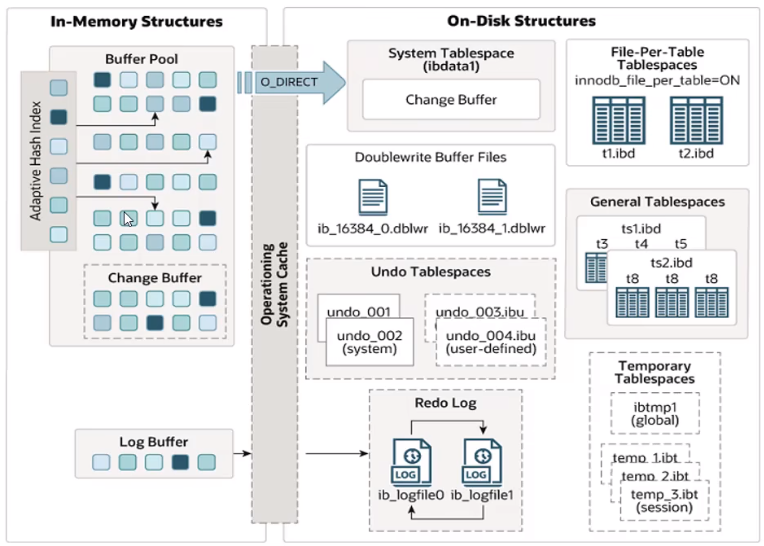

InnoDB 是一种兼顾高可靠性和高性能的通用存储引擎，在 MySQL 5.5 之后，InnoDB 是默认的 MySQL 存储引擎。

# 特点

- DML操作遵循ACID模型，支持**事务**；
- **行级锁**，提高并发访问性能；
- 支持**外键**约束，保证数据的完整性和正确性；
- 文件：xxx.ibd。每张表对应一个表空间文件，存储该表的结构、数据、索引。

# 逻辑存储结构


- 表空间（Tablespace）：ibd文件，一个mysql实例可以对应多个表空间，用于存储记录、索引等数据。
- 段（Segment）：分为数据段（Leaf node segment）、索引段（Non-leaf node segment）、回滚段（Rollback segment）。
  - InnoDB是索引组织表，数据段是B+树的叶子节点，索引段为B+树的非叶子节点。
- 区（Extent）：表空间的单元结构。
- 页（Page）：是InnoDB引擎磁盘管理的最小单元。为了保证页的连续性，InnoDB引擎每次从磁盘中申请4~5个区。
- 行（Row）：InnoDB引擎的数据是按行进行存放的。
  - Trx id：隐藏字段。最后一次修改操作的事务id。
  - Roll pointer：隐藏字段。每次针对某条记录进行改动时，都会把旧版本写入到 undo 日志中，这个隐藏字段相当于一个指针，可以通过它来找到该记录修改前的信息。

# 内存结构



## Buffer Pool

缓冲池是主内存中的一个区域，可以缓存磁盘上经常操作的真实数据。在执行增删改查操作时，先操作缓冲池中的数据（若没有则从磁盘加载并缓存），然后再以一定频率刷新到磁盘，从而减少磁盘IO，加快处理速度。

缓冲池以 page 为单位，底层采用链表管理 page。根据状态，将 page 分为三种类型：

- free page：空闲 page，未被使用。
- clean page：被使用了，但是没被修改过。
- dirty page：脏页，被使用且被修改过，页中数据与磁盘中数据不一致。

## Change Buffer

> 参考：http://www.xn--yrvs09a.xn--ses554g/archives/227/

当需要更新一个数据页时，如果数据页在内存中就直接更新，而如果这个数据页还没有在内存中的话，在不影响数据一致性的前提下，InnoDB 会将这些更新操作缓存在 change buffer 中，这样就不需要从磁盘中读入这个数据页了。在下次查询需要访问这个数据页的时候，将数据页读入内存（Buffer Pool），然后执行 change buffer 中与这个页有关的操作，这一过程被称为 merge。通过这种方式就能保证这个数据逻辑的正确性。

- 对于唯一索引，由于更新前要先将数据读入 Buffer Pool 检查唯一性，因此直接更新 Buffer Pool 更快，不需要使用 Change Buffer。
- 对于非唯一的普通索引，使用 change buffer 缓存更新操作能够减少磁盘读和减少 Buffer Pool 占用。

## Adaptive Hash Index

自适应hash索引，用于优化对Buffer Pool数据的查询。InnoDB存储引擎会监控对表上各索引页的查询，如果观察到hash索引可以提升速度，则建立hash索引，称之为自适应hash索引。
自适应哈希索引，无需人工干预，是系统根据情况自动完成。

```mysql
SHOW VARIABLES LIKE '%hash_index%';
# innodb_adaptive_hash_index # ON 开启，OFF 关闭
```

## Log Buffer

日志缓冲区，用于保存要写入到磁盘的日志数据（redo log，undo log），默认大写为16MB。缓冲区中的日志会定期刷新到磁盘，增加日志缓冲区的大小可以节省磁盘IO。

```mysql
SHOW VARIABLES LIKE 'innodb_log_buffer_size'; # 缓冲区大小
SHOW VARIABLES LIKE 'innodb_flush_log_at_trx_commit'; # 写入日志和刷新日志到磁盘的时机，{0|1|2}
```

刷新时机：

- 0：日志在每次事务提交时写入并刷新到磁盘。
- 1：每秒将日志写入并刷新到磁盘一次。
- 2：日志在每次提交事务后写入，并每秒刷新到磁盘一次。

# 磁盘结构


> 参考：https://zhuanlan.zhihu.com/p/614998035

## System Tablespace

系统表空间是更改缓冲区的存储区域。

```mysql
SHOW VARIABLES LIKE 'innodb_data_file_path'; # 系统表空间文件的文件名和属性
```

## File-Per-Table Tablespach

每个独立表空间包含单个InnoDB表的数据和索引，并存储在文件系统中的单个数据文件中。

- 每一个表就是一个表空间，一个表一个文件（分区表可能有多个）。
- 由参数innodb_file_per_table控制，默认打开（ON）。

## General Tablespace

通用表空间是使用`CREATE TABLESPACE`语法创建的共享InnoDB表空间。

在创建表时，可以指定在该表空间中创建。

```mysql
CREATE TABLESPACE ts_name ADD
DATAFILE 'file_name' # 指定关联的表空间文件
ENGINE=engind_name;

CREATE TABLE xxx ... TABLESPACE ts_name;
```

## Undo Tablespace

撤销表空间。mysql 实例会在初始化时会自动创建两个默认的undo表空间（初始大小16M），用于存储undo log日志。

## Temporary Tablespace

InnoDB使用会话临时表空间和全局临时表空间。存储用户创建的临时表等数据。

## Doublewrite Buffer Files

双写缓冲区，innoDB引擎将数据页从Buffer Pool刷新到磁盘前，先将数据页写入双写缓冲区文件中，便于系统异常时恢复数据。

## Redo Log

> 参考：https://zhuanlan.zhihu.com/p/552706911

重做日志，是用来实现事务的持久性。该日志文件由两部分组成：重做日志缓冲（redo log buffer）以及重做日志文件（redo log），前者是在内存中，后者在磁盘中。当事务提交之后会把所有修改信息都会存到该日志中，用于在刷新脏页到磁盘时，发生错误时，进行数据恢复使用。

redo log 是顺序写入，效率高。

# 线程模型


> 参考：https://blog.csdn.net/qq_26664043/article/details/135821673

在 InnoDB 中，后台线程的主要作用是：

1. 刷新内存中的数据，保证缓冲池中的数据是最新的。
2. 将缓冲区中的数据刷新到磁盘，保证发生异常时，能够进行恢复。

InnoDB后台线程模型是一个多线程架构，旨在充分利用多核处理器的优势，实现高效的并发处理。它主要包括Master Thread（主线程）、IO Thread（IO线程）、Purge Thread（清除线程）和Page Cleaner Thread（页面清洁线程）等组件。

## Master Thread

核心后台线程，负责调度其他线程，还负责将缓冲池中的数据异步刷新到磁盘中，保持数据的一致性，还包括脏页的刷新、合并插入缓存、undo页的回收。

## IO Thread

在InnoDB存储引擎中大量使用了异步IO（AIO）来处理IO请求，这样可以极大地提高数据库的性能，而IO Thread主要负责这些IO请求的回调。

| 线程类型             | 默认个数 | 职责                           |
| -------------------- | -------- | ------------------------------ |
| Read Thread          | 4        | 负责读操作                     |
| Write Thread         | 4        | 负责写操作                     |
| Log Thread           | 1        | 负责将日志缓冲区内容刷新到磁盘 |
| Insert buffer thread | 1        | 负责将写缓冲区内容刷新到磁盘   |

## Purge Thread

主要用于回收事务已经提交了的undo log，在事务提交之后，undo log可能不用了，就用它来回收。

## Page Cleaner Thread

协助Master Thread刷新脏页到磁盘的线程，它可以减轻Master Thread的工作压力，减少阻塞。

# 事务原理


## redo log

重做日志。记录事务提交时数据页的修改结果（**物理日志**），用来实现事务的**持久性**。

该日志文件由两部分组成：重做日志缓冲（redo log buffer）以及重做日志文件（redo log file），前者是在内存中，后者在磁盘中。当事务提交之后会把所有修改信息都存到该日志文件中，用于在刷新脏页到磁盘，发生错误时，进行数据恢复使用。

## undo log

回滚日志。用于记录数据被修改前的信息，用于实现回滚和MVCC（多版本并发控制）。保证事务的**原子性**。

undo log 记录的是**逻辑日志**，记录的是 SQL 语句，比如说事务执行一条 DELETE 语句，那 undo log 就会记录一条相对应的 INSERT 语句。

Undo log销毁：undo log在事务执行时产生，事务提交时，并不会立即删除undo log，因为这些日志可能还用于**MVCC**。

Undo log存储：undo log采用段的方式进行管理和记录，存放在前面介绍的 rollback segment（回滚段）中，内部包含1024个undo log segment。

redo log 和 undo log 共同保证事务的**一致性**。

# MVCC

> 参考：https://zhuanlan.zhihu.com/p/428066667

## 基本概念

### 当前读

读取的是记录的最新版本（即使隔离级别是RR），读取时还要保证其他并发事务不能修改当前记录，会对读取的记录进行加锁。对于我们日常的操作，如：

select ... lock in share mode（共享锁），select ... for update，insert，delete（排他锁）都是一种当前读。

### 快照读

简单的 select（不加锁）就是快照读，读取的可能是历史数据。不加锁，是非阻塞读。

- Read Committed：每次 select 都生成一个快照。
- Repeatable Read：开启事务后的第一个 select 语句生成快照。
- Serializable：退化为当前读。

### MVCC

全称 Multi-Version Concurrency Control，多版本并发控制。指维护一个数据的多个版本，使得读写操作没有冲突，快照读为MySQL实现MVCC提供了一个非阻塞读功能。MVCC的具体实现，还需要依赖于数据库记录中的三个隐式字段、undo log日志、readView。

## 实现原理

### 三个隐藏字段

1. **DB_TRX_ID**：最近修改事务的 ID，插入或最后一次修改该记录的事务 ID。
2. **DB_ROLL_PTR**：回滚指针，指向这条记录的上一个版本。用于配合 undo log。
3. **DB_ROW_ID**：隐藏主键，若表没有指定主键，则会生成该隐藏字段。

### undo log

回滚日志，在insert、update、delete的时候产生的便于数据回滚的日志。  
当insert的时候，产生的undo log日志只在回滚时需要，在事务提交后，可被立即删除。  
而update、delete的时候，产生的undo log日志不仅在回滚时需要，在快照读时也需要，不会立即被删除。

### readview

readview是快照读 sql 执行时 MVCC 提取数据的依据，记录并维护系统当前活跃的事务（未提交）的 id。

readview包含以下四个核心字段：

| 字段           | 含义                                                       |
| -------------- | ---------------------------------------------------------- |
| m_ids          | 当前活跃的事务 ID 集合                                     |
| min_trx_id     | 最小活跃事务 id                                            |
| max_trx_id     | 预分配事务 id，为当前最大事务 id+1（因为事务 id 是自增的） |
| creator_trx_id | readview创建者的事务 id                                    |

**版本数据链访问规则：**

|                                    | 是否可访问该版本                | 说明                                 |
| ---------------------------------- | ------------------------------- | ------------------------------------ |
| trx_id == creator_trx_id           | 可以                            | 说明数据是当前事务更改的             |
| trx_id < min_trx_id                | 可以                            | 说明数据已提交                       |
| trx_id > max_trx_id                | 不可以                          | 说明事务是在 readview 生成后才开启的 |
| min_trx_id <= trx_id <= max_trx_id | 若 trx_id 不在 m_ids 中，则可以 | 说明数据已提交                       |

不同隔离级别，生成 readview 的时机不同：

- read commited：在事务中每一次执行快照读时生成 readview
- repeatable read：仅在事务第一次执行快照读时生成 readview，后续复用该 readview

