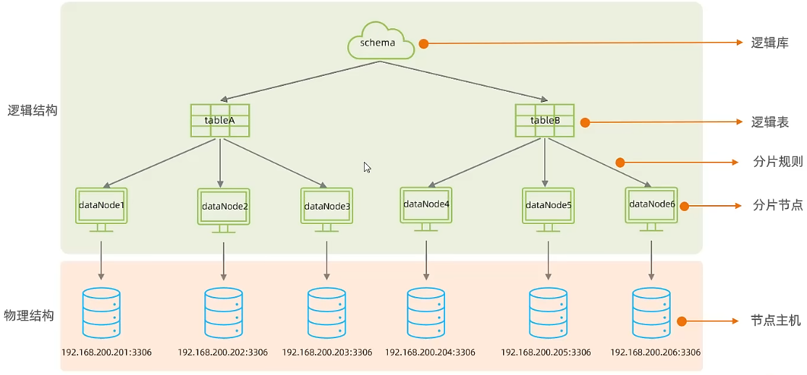

# 介绍

## 垂直拆分

**垂直分表**：以字段列为单位，将大表拆分成小表

- 不同表结构、数据都不同。

- 不同表之间一般通过主键/外键关联。

**垂直分库**：以表为单位，将不同表分到不同库中。

## 水平拆分

**水平分表**：根据某一字段，以某种规则，以行为单位进行拆分。

- 不同表结构相同，数据行不同。

**水平分库**：将水平拆分后的表放在不同的库中。

# Mycat

> 参考：http://www.mycat.org.cn/
>
> https://www.bilibili.com/video/BV1Kr4y1i7ru/?p=165

Mycat是开源的、活跃的、基于Java语言编写的MySQL数据库中间件。可以像使用mysql一样来使用mycat，对于开发人员来说根本感觉不到mycat的存在。

## 分库分表

垂直分库：以表为单位，分配到不同节点中。

水平分库：将一个表的行以某种分片规则分配到不同节点中。

## 分片规则（水平分库分表）

1. 范围分片：根据指定字段及设定的范围来决定数据数据哪个节点。

2. 取模分片：根据指定的字段值对节点数量求模，根据运算结果进行分片。

3. 一致性哈希：计算指定字段（如uuid）的哈希值，哈希值对某个特定数取模，根据计算结果进行分片。

   > 参考：https://blog.csdn.net/weixin_45683778/article/details/136694740

4. 根据枚举值进行分片。如省份、性别、状态等。

5. 应用指定分片：根据某一字段的子字符串（必须是纯数字）进行分片。

6. 固定分片哈希算法：与二进制数进行位运算，根据结果的范围进行分片。如与 111111111 进行位&运算。

   - 取模分片会将连续值分配到不同分片，而此算法连续值可能分片到相同分片，降低事务处理难度。
   - 可以均匀分配，也可以非均匀分配。
   - 分片字段必须位数字类型。

7. 字符串哈希解析：取指定字段的子字符串，通过哈希算法（如6中的位&算法）计算子字符串的哈希值，根据哈希值进行分片。

8. 按日期（天）分片：不同时间区间的数据分配到不同库。

9. 按日期（月）分片：不同月份的数据分片到不同库。

# 读写分离

含义：把数据库的读操作和写操作分开，主数据库提供写操作，从数据库提供读操作，以减轻单台数据库的压力。可以通过mycat等中间件实现。

一主一从：一个主库+一个从库。

双主双从：两个主库和对应的从库，主库直接互为从库。这些一个主节点挂掉了另一个主节点可以作为备份。
