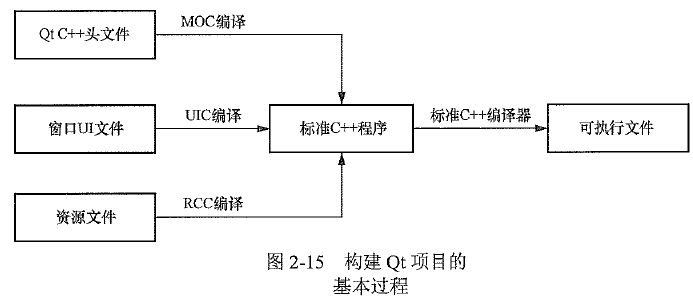

# 基本概念

## 窗口基类

### QMainWindow

主窗口类，主窗口类具有菜单栏、工具栏和状态栏。

### QWidget

所有界面组件类的基类，QWidget可以作为独立的窗口，就是一个空白的窗口。

### Qdialog

对话框类，窗口具有对话框的显示效果，例如没有最大化按钮。

## 项目构建



MOC：元对象编译器

UIC：用户界面编译器

RCC：资源编译器

# TIPS

## QApplication

```cpp
// main.cpp
#include <QApplication>

#include "widget.h"

int main(int argc, char *argv[]) {
  QApplication a(argc, argv);  // 创建GUI对象
  Widget w;                    // 创建窗口
  w.show();                    // 显示窗口
  return a.exec();             // 开始事件循环
}
```

## Q_OBJECT 宏

类中包含信号或槽时，必须在类开头包含这个宏。

## 槽函数 private slots

## 自定义信号 signals

```cpp
#ifndef WIDGET_H
#define WIDGET_H

#include <QWidget>

class Widget : public QWidget {
  Q_OBJECT
 private:
  // 私有成员

 private slots:
  // 槽函数声明在这里

 public:
  Widget(QWidget *parent = nullptr);  // 构造函数，需指定父组件
  ~Widget();
  
  signals:
    // 自定义信号只需要声明，不需要实现
    void mySignal(int value);
};
#endif  // WIDGET_H
```

```cpp
emit mySignal(114514); // 发射信号，会触发所有连接到 mySignal 的槽函数
```

## 容器组件被销毁时，其内部的组件也会被自动销毁。

因此在使用 new 创建组件对象后，只需设置好其父组件，不需要手动 delete。

## connect() 连接信号与槽

## disconnect() 解除信号与槽的连接

> 参见：https://doc.qt.io/qt-6/qobject.html

```cpp
// 发出信号的对象 发出的信号 接收信号的对象 处理信号的函数

// 使用宏（最通用，但是没有错误检查）
connect(btnCheckBold, SIGNAL(clicked(bool)), this,
        SLOT(do_btnCheckBold(bool)));

// 使用函数指针
// clicked 有带参和不带参的版本，编译器根据槽函数自动选择
// 槽函数重载时要使用static_cast显式指定函数指针类型，或使用模板函数qOverload()来明确参数类型）
connect(btnCheckUnderline, &QCheckBox::clicked, this,
        &Widget::do_btnCheckUnderline);

// 使用Lambda表达式
connect(btnCheckItalic, &QCheckBox::clicked, [this](bool checked) {
  QFont font = text->font();
  font.setItalic(checked);
  text->setFont(font);
});

// 使用成员函数，this为接收信号的对象
this->connect(checkBoxRed, &QCheckBox::clicked, [this](bool checked) {
  QPalette palette = text->palette();
  QColor color = Qt::black;
  if (checked) color = Qt::red;
  palette.setColor(QPalette::WindowText, color);
  text->setPalette(palette);
});
```


