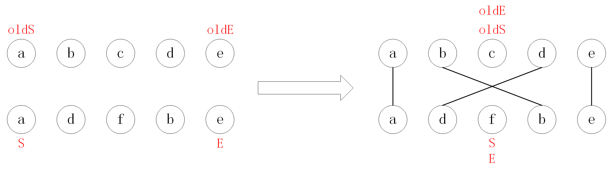
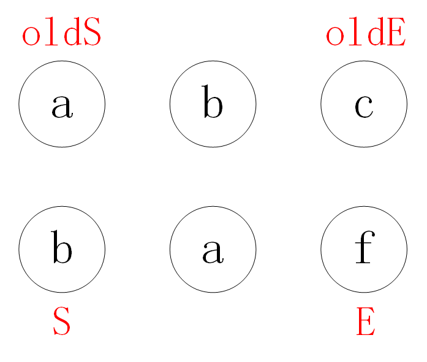

参考资料
    [深度剖析：如何实现一个 Virtual DOM 算法](https://github.com/livoras/blog/issues/13)

# 一、 虚拟DOM：用 js 对象描述 DOM 的层次结构

真实 DOM 对象具有非常多的属性，直接操作起来效率很低，相比之下，操作原生 js 对象速度更快且更简单。

可以使用 js 对象来模拟真实 DOM 树：

```javascript
var element = {
  tagName: 'ul', // 节点标签名
  props: { // DOM的属性，用一个对象存储键值对
    id: 'list'
  },
  children: [ // 该节点的子节点
    {tagName: 'li', props: {class: 'item'}, children: ["Item 1"]},
    {tagName: 'li', props: {class: 'item'}, children: ["Item 2"]},
    {tagName: 'li', props: {class: 'item'}, children: ["Item 3"]},
  ]
}
```
对应的 html 代码
```html
<ul id='list'>
  <li class='item'>Item 1</li>
  <li class='item'>Item 2</li>
  <li class='item'>Item 3</li>
</ul>
```

Virtual DOM 算法流程：

1. 用 js 对象构建虚拟 DOM 树，依据虚拟 DOM 树构建真实 DOM 树；
2. 内容发生变化时，重新构造一棵新的虚拟 DOM 树，与旧虚拟 DOM 树进行比较，记录差异；
3. 将 2 中记录的差异反映到真实 DOM 树上。

# 二、diff算法

**比较新旧虚拟 DOM 树，依据比较结果操作真实 DOM**

两棵树的完整的 diff 算法的时间复杂度是 O(n^3) （比较 O(n^2)，增删改 O(n)）。

vue 中只比较同层的节点，算法的时间复杂度为 O(n)

diff算法的核心目的：**当新旧 vnode 的子节点都是一组节点时，以最小的开销完成更新**。


## [vue2 双端diff](https://juejin.cn/post/6844903607913938951)

```javascript
updateChildren (parentElm, oldCh, newCh) {
    let oldStartIdx = 0, newStartIdx = 0
    let oldEndIdx = oldCh.length - 1
    let oldStartVnode = oldCh[0]
    let oldEndVnode = oldCh[oldEndIdx]
    let newEndIdx = newCh.length - 1
    let newStartVnode = newCh[0]
    let newEndVnode = newCh[newEndIdx]
    let oldKeyToIdx
    let idxInOld
    let elmToMove
    let before
    while (oldStartIdx <= oldEndIdx && newStartIdx <= newEndIdx) {
        if (oldStartVnode == null) {
            oldStartVnode = oldCh[++oldStartIdx] 
        }else if (oldEndVnode == null) {
            oldEndVnode = oldCh[--oldEndIdx]
        }else if (newStartVnode == null) {
            newStartVnode = newCh[++newStartIdx]
        }else if (newEndVnode == null) {
            newEndVnode = newCh[--newEndIdx]
        }else if (sameVnode(oldStartVnode, newStartVnode)) { // 首 首，直接复用
            patchVnode(oldStartVnode, newStartVnode) // 向下递归比较其子节点
            oldStartVnode = oldCh[++oldStartIdx]
            newStartVnode = newCh[++newStartIdx]
        }else if (sameVnode(oldEndVnode, newEndVnode)) { // 尾 尾，直接复用
            patchVnode(oldEndVnode, newEndVnode)
            oldEndVnode = oldCh[--oldEndIdx]
            newEndVnode = newCh[--newEndIdx]
        }else if (sameVnode(oldStartVnode, newEndVnode)) { // 首 尾，移动到当前尾部
            patchVnode(oldStartVnode, newEndVnode)
            api.insertBefore(parentElm, oldStartVnode.el, api.nextSibling(oldEndVnode.el))
            oldStartVnode = oldCh[++oldStartIdx]
            newEndVnode = newCh[--newEndIdx]
        }else if (sameVnode(oldEndVnode, newStartVnode)) { // 尾 首，移动到当前首部
            patchVnode(oldEndVnode, newStartVnode)
            api.insertBefore(parentElm, oldEndVnode.el, oldStartVnode.el)
            oldEndVnode = oldCh[--oldEndIdx]
            newStartVnode = newCh[++newStartIdx]
        }else { // 新旧节点都未比较完
            if (oldKeyToIdx === undefined) { // 依据节点的 key 为旧节点生成 key:节点idx 的哈希表
                oldKeyToIdx = createKeyToOldIdx(oldCh, oldStartIdx, oldEndIdx)
            }
            idxInOld = oldKeyToIdx[newStartVnode.key] // 寻找和新节点同 key 的旧节点
            if (!idxInOld) { // 若未找到，创建新节点
                api.insertBefore(parentElm, createEle(newStartVnode).el, oldStartVnode.el)
                newStartVnode = newCh[++newStartIdx]
            }
            else { // 找到同 key 节点
                elmToMove = oldCh[idxInOld]
                if (elmToMove.sel !== newStartVnode.sel) { // 若二者不为相同节点，创建新节点
                    api.insertBefore(parentElm, createEle(newStartVnode).el, oldStartVnode.el)
                }else { // 若二者为相同节点，移动到对应位置
                    patchVnode(elmToMove, newStartVnode)
                    oldCh[idxInOld] = null
                    api.insertBefore(parentElm, elmToMove.el, oldStartVnode.el)
                }
                newStartVnode = newCh[++newStartIdx]
            }
        }
    }
    if (oldStartIdx > oldEndIdx) { // 存在多余的新节点，创建
        before = newCh[newEndIdx + 1] == null ? null : newCh[newEndIdx + 1].el
        addVnodes(parentElm, before, newCh, newStartIdx, newEndIdx)
    }else if (newStartIdx > newEndIdx) { // 存在多余的旧节点，删除
        removeVnodes(parentElm, oldCh, oldStartIdx, oldEndIdx)
    }
}
```

步骤：

1. 比较首首、尾尾，相同则复用，不需要操作真实DOM；比较首尾，尾首，相同则移动真实 DOM 中的节点到对应位置。



2. 第 1 步后，若新旧节点都有剩余，则为剩余旧节点生成 `key: idx` 的哈希表；遍历剩余新节点，使用其 key 查找哈希表，若存在对应旧节点且二者为相同节点，复用（移动），否则创建新节点并挂载到真实 DOM 上对应位置。

   

   如上图，a 节点和 b 节点可以复用，f 节点需要创建

2. 第 1、2 步后，若旧节点有剩余，则删除真实DOM中对应节点；若新节点有剩余，则创建新节点并挂载到真实 DOM 上对应位置。


## [vue3 快速diff](https://zhuanlan.zhihu.com/p/459134214)

子节点均不存在 key 时：[patchUnkeyedChildren](https://github.com/vuejs/core/blob/main/packages/runtime-core/src/renderer.ts#L1693)

```typescript
// 省略后的代码
const patchUnkeyedChildren = ( c1: VNode[], c2: VNodeArrayChildren, ...) => {
  c1 = c1 || EMPTY_ARR
  c2 = c2 || EMPTY_ARR
  const oldLength = c1.length
  const newLength = c2.length
  const commonLength = Math.min(oldLength, newLength)
  let i
  for (i = 0; i < commonLength; i++) { // 从前往后暴力比较
    const nextChild = (c2[i] = optimized
      ? cloneIfMounted(c2[i] as VNode)
      : normalizeVNode(c2[i]))
    patch(c1[i], nextChild, ...)
  }
  if (oldLength > newLength) {
    // remove old
    unmountChildren(c1, ..., commonLength)
  } else {
    // mount new
    mountChildren(c2, ..., commonLength)
  }
}
```

直接按照索引进行比较，旧节点有剩余则删除，新节点有剩余则添加


子节点存在或部分存在key时：[patchKeyedChildren](https://github.com/vuejs/core/blob/main/packages/runtime-core/src/renderer.ts#L1753)

```typescript
// can be all-keyed or mixed
const patchKeyedChildren = (c1: VNode[], c2: VNodeArrayChildren, ...) => {
  let i = 0
  const l2 = c2.length
  let e1 = c1.length - 1 // prev ending index
  let e2 = l2 - 1 // next ending index
  
  // 1... 2... 3... 4... 5...
}
```

1. 从首部开始比较，相同则复用。

2. 从尾部开始比较，相同则复用。

   ```typescript
   // 1. sync from start
   // (a b) c
   // (a b) d e
   while (i <= e1 && i <= e2) {
     const n1 = c1[i]
     const n2 = (c2[i] = optimized
       ? cloneIfMounted(c2[i] as VNode)
       : normalizeVNode(c2[i]))
     if (isSameVNodeType(n1, n2)) {
       patch(n1, n2, ...)
     } else {
       break
     }
     i++
   }
   
   // 2. sync from end
   // a (b c)
   // d e (b c)
   while (i <= e1 && i <= e2) {
     const n1 = c1[e1]
     const n2 = (c2[e2] = optimized
       ? cloneIfMounted(c2[e2] as VNode)
       : normalizeVNode(c2[e2]))
     if (isSameVNodeType(n1, n2)) {
       patch(n1, n2, ...)
     } else {
       break
     }
     e1--
     e2--
   }
   ```

3. 若仅新节点有剩余，创建

4. 若仅旧节点有剩余，删除

   ```typescript
   // 3. common sequence + mount
   // (a b)
   // (a b) c
   // i = 2, e1 = 1, e2 = 2
   // (a b)
   // c (a b)
   // i = 0, e1 = -1, e2 = 0
   if (i > e1) {
     if (i <= e2) {
       const nextPos = e2 + 1
       const anchor = nextPos < l2 ? (c2[nextPos] as VNode).el : parentAnchor
       while (i <= e2) {
         patch(
           null,
           (c2[i] = optimized
             ? cloneIfMounted(c2[i] as VNode)
             : normalizeVNode(c2[i])),
           ...
         )
         i++
       }
     }
   }
   
   // 4. common sequence + unmount
   // (a b) c
   // (a b)
   // i = 2, e1 = 2, e2 = 1
   // a (b c)
   // (b c)
   // i = 0, e1 = 0, e2 = -1
   else if (i > e2) {
     while (i <= e1) {
       unmount(c1[i], parentComponent, parentSuspense, true)
       i++
     }
   }
   ```

5. 新旧节点均有剩余

   ```typescript
   // 5. unknown sequence
   // [i ... e1 + 1]: a b [c d e] f g
   // [i ... e2 + 1]: a b [e d c h] f g
   // i = 2, e1 = 4, e2 = 5
   else {
     const s1 = i; // prev starting index
     const s2 = i; // next starting index
       
     // 5.1... 5.2... 5.3...
   }
   ```

   

   5.1 为新节点构建 `key: idx` 哈希表 `keyToNewIndexMap`

   ```typescript
   // 5.1 build key:index map for newChildren
   const keyToNewIndexMap: Map<string | number | symbol, number> = new Map()
   for (i = s2; i <= e2; i++) {
     const nextChild = (c2[i] = optimized
       ? cloneIfMounted(c2[i] as VNode)
       : normalizeVNode(c2[i]))
     if (nextChild.key != null) {
       if (__DEV__ && keyToNewIndexMap.has(nextChild.key)) {
         warn(
           `Duplicate keys found during update:`,
           JSON.stringify(nextChild.key),
           `Make sure keys are unique.`
         )
       }
       keyToNewIndexMap.set(nextChild.key, i)
     }
   }
   ```

   

   5.2 从左到右遍历旧节点，匹配 key 相同的节点；对于无 key 的旧节点，匹配从左到右第一个无 key 且与该节点类型相同且尚未被匹配的新节点。

   建立新节点索引到与之匹配的旧节点索引的映射表 `newIndexToOldIndexMap`。

   注意：val 为旧节点索引值 +1 ，0表示无匹配。

   删除找不到匹配的旧节点。

   同时记录是否存在乱序 `moved` ，若 `moved===true` ，则第 5.3 步中需要对节点进行移动。

   ```typescript
   // 5.2 loop through old children left to be patched and try to patch
   // matching nodes & remove nodes that are no longer present
   let j
   let patched = 0
   const toBePatched = e2 - s2 + 1
   let moved = false
   // used to track whether any node has moved
   let maxNewIndexSoFar = 0
   // works as Map<newIndex, oldIndex>
   // Note that oldIndex is offset by +1
   // and oldIndex = 0 is a special value indicating the new node has
   // no corresponding old node.
   // used for determining longest stable subsequence
   const newIndexToOldIndexMap = new Array(toBePatched)
   for (i = 0; i < toBePatched; i++) newIndexToOldIndexMap[i] = 0
   
   for (i = s1; i <= e1; i++) {
     const prevChild = c1[i]
     if (patched >= toBePatched) {
       // all new children have been patched so this can only be a removal
       unmount(prevChild, parentComponent, parentSuspense, true)
       continue
     }
     let newIndex
     if (prevChild.key != null) {
       newIndex = keyToNewIndexMap.get(prevChild.key)
     } else {
       // key-less node, try to locate a key-less node of the same type
       for (j = s2; j <= e2; j++) {
         if (
           newIndexToOldIndexMap[j - s2] === 0 &&
           isSameVNodeType(prevChild, c2[j] as VNode)
         ) {
           newIndex = j
           break
         }
       }
     }
     if (newIndex === undefined) { // 删除找不到匹配的旧节点
       unmount(prevChild, parentComponent, parentSuspense, true)
     } else {
       newIndexToOldIndexMap[newIndex - s2] = i + 1
       if (newIndex >= maxNewIndexSoFar) {
         maxNewIndexSoFar = newIndex
       } else { // 存在乱序，需要移动节点（第5.3步）
         moved = true
       }
       patch(prevChild, c2[newIndex] as VNode, ...)
       patched++
     }
   }
   ```

   

   5.3 移动可复用节点，创建新增节点

   计算 `newIndexToOldIndexMap` 的最长递增子序列 `increasingNewIndexSequence` ，其中记录的是位于最长递增子序列中的新节点的索引。

   **从右到左**（便于判断索引是否位于 `increasingNewIndexSequence` 中）遍历新节点，

   - 若无与之匹配的旧节点，则创建并挂载该节点；

   - 若存在匹配的旧节点，且当前索引位于 `increasingNewIndexSequence` 中，不需要处理；
   - 若存在匹配的旧节点，但当前索引不在 `increasingNewIndexSequence` 中，则需要进行移动。

   注：若 5.2中 `moved===false` ，表明不存在乱序，则只需要创建并挂载无匹配的新节点。

   ```typescript
   // 5.3 move and mount
   // generate longest stable subsequence only when nodes have moved
   const increasingNewIndexSequence = moved
     ? getSequence(newIndexToOldIndexMap)
     : EMPTY_ARR
   j = increasingNewIndexSequence.length - 1
   // looping backwards so that we can use last patched node as anchor
   for (i = toBePatched - 1; i >= 0; i--) {
     const nextIndex = s2 + i
     const nextChild = c2[nextIndex] as VNode
     const anchor =
       nextIndex + 1 < l2 ? (c2[nextIndex + 1] as VNode).el : parentAnchor
     if (newIndexToOldIndexMap[i] === 0) {
       // mount new
       patch(null, nextChild, ...)
     } else if (moved) { // 只有存在乱序时才需要移动
       // move if:
       // There is no stable subsequence (e.g. a reverse)
       // OR current node is not among the stable sequence
       if (j < 0 || i !== increasingNewIndexSequence[j]) {
         move(nextChild, container, anchor, MoveType.REORDER)
       } else {
         j--
       }
     }
   }
   ```

   

