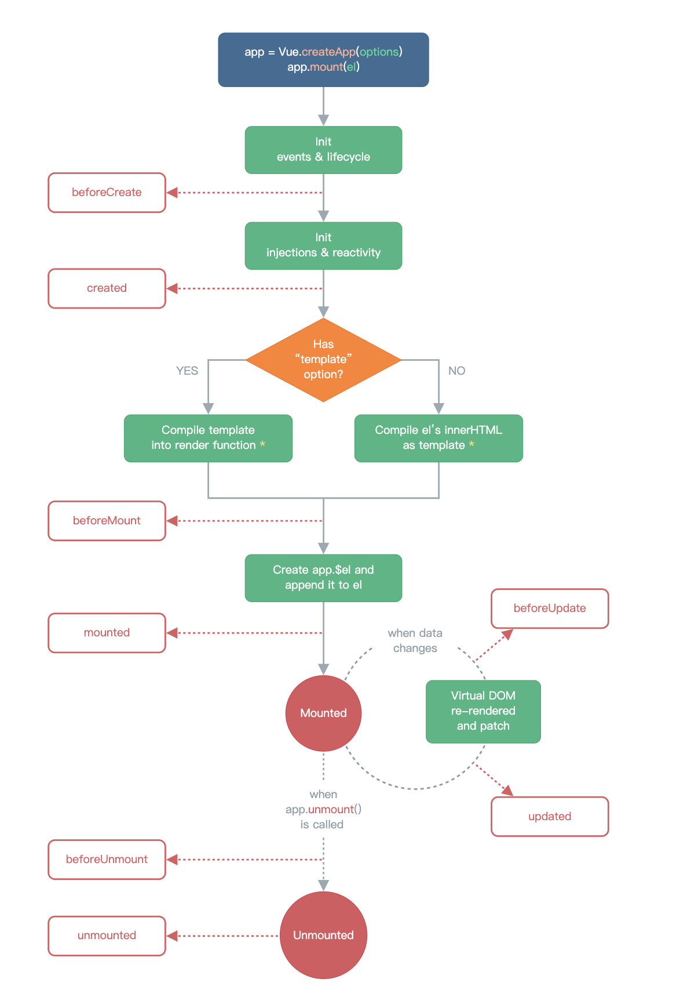

# 一、[组件的生命周期](https://xiaoman.blog.csdn.net/article/details/122811060)



1. 对于组件式 API ，没有 `beforeCreate` 和 `create` 。
1. 在组件挂载后（`onMounted`）才能访问 DOM 。
1. 对于 `<KeepAlive>` 缓存树中的组件，还有 `onActivated` 和 `onDeactivated` 这两个生命周期钩子。

# 二、父子组件传参 `Props`

**任何类型**的值都可以作为props的值被传递。

静态传参：`title="字符串"`；动态传参：`:title="str1"`

```vue
<!-- 父组件 -->
<template>
 <A :vName="vName" :age="17" :address="`bilibili`"></A>
</template>

<script setup>
import A from "./components/A.vue";
const vName = "Taffy";
</script>
```

```vue
<template>
 <!-- 子组件 -->
 <div>{{ props.vName }} -- {{ props.age }} -- {{ props.address }}</div>
</template>

<script setup>
// 需要定义一个参数来接收 props
// const props = defineProps(["vName", "age", "address"]);  // 数组形式
// 对象形式
const props = defineProps({
 vName: String,
 age: {
   type: Number,
   default: 0, // 默认值
 },
 address: String,
});
</script>
```

注意：props 传参是单向的，无法在子组件中修改 prop

```javascript
const props = defineProps(['foo'])

// ❌ 警告！prop 是只读的！
props.foo = 'bar'
```

# 三、自定义事件 `emit`

父组件中通过 `v-on` （缩写：`@`）来监听事件并向子组件传递回调函数。

组件的事件监听器也支持 `.once` 等修饰符。

```vue
<A @show-msg.once="(msg) => console.log(msg)"></A>
<A @show-msg.once="fn"></A>
```

子组件中可以直接使用 `$emit()` 来触发自定义事件。

   ```vue
   <button @click="$emit(`show-msg`, `Hello!`)">按钮</button>
   ```

  也可以在子组件的 `script` 中声明要触发的事件，通过 `emit()` 触发事件。

   ```javascript
   const emit = defineEmits(["show-msg"]);
   function handleClick() {
     emit("show-msg", "Hello!");
   }
   ```

# 四、`defineExpose()` 向父组件暴露属性或方法

   `<script setup>`中默认关闭暴露，可以通过`defineExpose()`指定要暴露的属性。

   暴露的属性可以通过模板引用进行访问

   ```vue
   <!-- 父组件 -->
   <template>
     <A ref="child"></A>
   </template>
   
   <script setup>
   import { onMounted, ref } from "vue";
   import A from "./components/A.vue";
   const child = ref(null);
   onMounted(() => {
     // 组件渲染完成后，才能获取子组件实例的属性
     console.log(child.value);
   });
   </script>
   ```

   ```vue
   <!-- 子组件 -->
   <script setup>
   const msg = "Hello!";
   defineExpose({
     msg,
   });
   </script>
   ```

# 五、注册全局组件

``` javascript
// main.js
import { createApp } from "vue";
import App from "./App.vue";
import GlobalVue from "./components/GlobalVue.vue";
const app = createApp(App);
app.component("GlobalVue", GlobalVue); // 注册全局组件
app.mount("#app");
```

注册后可以在其他文件中直接使用（不需要 import ）。

```vue
<!-- A.vue -->
<GlobalVue></GlobalVue>
```


# 六、递归组件

一个单文件组件可以通过它的文件名被其自己所引用。

```vue
<!-- Circle.vue -->
<template>
  <div v-if="count >= 0" class="compb__circle" :style="{ width: r, height: r }">
    <Circle :count="count - 1"></Circle>
  </div>
</template>

<script setup>
const props = defineProps(["count"]);
const count = props.count;
const r = count * 40 + 20 + "px";
</script>

<style scoped>
.compb__circle {
  border: 2px solid #000;
  border-radius: 50%;

  display: flex;
  justify-content: center;
  align-items: center;
}
</style>
```

也可以自定义组件名称

```vue
<script>
export default {
  name: "Circle1",
};
</script>

<!-- 或者直接在 setup 中设置 -->
<script setup>
defineOptions({
  name: "Circle2",
});
</script>
```

# 七、动态组件

可以通过设置 `<component>` 元素的 `is` attribute 来实现动态切换组件。

被传给 `:is` 的值可以是：

1. 被导入的组件对象
2. 被注册的组件名（字符串）

```vue
<template>
  <component :is="cmpId"></component>
</template>

<script setup>
import A from "./components/A.vue";
import B from "./components/B.vue";
import { ref, shallowRef } from "vue";
// const cmpId = ref(A);
const cmpId = shallowRef(A);
cmpId.value = B; // 切换为 B 组件
</script>
```

```vue
<template>
  <component :is="cmpId" :count="5"></component>
  <hr />
  <!-- 组件名已注册，此时使用组件名或组件对象均可 -->
  <button @click="cmpId = A">A</button>
  <button @click="cmpId = `B`">B</button>
</template>

<script setup>
import { shallowRef } from "vue";
const cmpId = shallowRef(`A`);
</script>

<script>
import A from "./components/A.vue";
import B from "./components/B.vue";
export default {
  components: { // 注册组件
    A,
    B,
  },
};
</script>
```


注1：一般使用 `shallowRef` 或 `markRaw` 等来避免深层响应式转换，节约性能。

注2：当使用 `<component :is="...">` 来在多个组件间作切换时，被切换掉的组件会被卸载。可以通过 `KeepAlive` 组件强制被切换掉的组件仍然保持“存活”的状态。

# 八、插槽 `slot`

8.1 插槽入口的内容会替换插槽出口的内容，若入口无内容，则显示默认内容

```vue
<!-- App.vue -->
<C>插入的内容</C> <!-- 插槽入口 -->

<!-- C.vue -->
<div>
  <slot>默认内容</slot> <!-- 插槽出口 -->
</div>
```


注意1：插槽内容可以访问到父组件的数据作用域，因为插槽内容本身是在父组件模板中定义的。

8.2 具名插槽

一个组件中包含多个插槽时，为了区分，可以使用具名插槽。

通过设置 `<slot>` 元素的 `name` attribute 来设置插槽的名称，没有设置 `name` 的插槽名称为 `default` 。

```vue
<!-- App.vue -->
<template>
  <C>
    插入默认插槽
    <template v-slot:box1> 插入具名插槽 </template> <!-- v-slot:box1 可以简写为 #box1 -->
  </C>
</template>

<!-- C.vue -->
<div class="box1">
  <slot :name="`box1`"></slot> <!-- 插槽名为 `box1` -->
</div>
<div class="box2">
  <slot></slot> <!-- 默认插槽名为 `default`，有其他具名插槽时，最好也显式标明 `defalut` -->
</div>
```

插槽名支持动态参数

```vue
<base-layout>
  <template #[dynamicSlotName]>
    ...
  </template>
</base-layout>
```

8.3 作用域插槽

默认情况下，插槽只能访问父组件作用域中的内容，无法访问到子组件的内容。

可以使用作用域插槽将子组件的参数传递给父组件。

```vue
<!-- 父组件 -->
<C>
  <template v-slot:box1="box1Props"> 插入具名插槽 -- {{ box1Props.msg1 }} </template>
</C>

<!-- 子组件 -->
<div class="box1">
  <slot :name="`box1`" :msg1="msg1"></slot>
</div>
```

# 九、异步组件（通过顶层 `await`）

`<script setup>` 中可以使用顶层 `await`。最终代码会被编译成 `async setup()`：

```vue
<!-- AsyncComp.vue -->
<script setup>
const post = await fetch(`/api/post/1`).then((r) => r.json())
</script>
```

通过 `defineAsyncComponent()` 引入异步组件

```js
<!-- App.vue -->
import { defineAsyncComponent } from 'vue'

const AsyncComp = defineAsyncComponent(() => {
  return new Promise((resolve, reject) => {
    // ...从服务器获取组件
    resolve(/* 获取到的组件 */)
  })
})
```

`defineAsyncComponent` 方法接收一个返回 **Promise** 的加载函数。这个 Promise 的 `resolve` 回调方法应该在从服务器获得组件定义时调用。

[ES 模块动态导入](https://developer.mozilla.org/en-US/docs/Web/JavaScript/Reference/Operators/import)也会返回一个 Promise，可以用它来导入 Vue 单文件组件

```js
<!-- App.vue -->
import { defineAsyncComponent } from 'vue'

const AsyncComp = defineAsyncComponent(() =>
  import('./components/AsyncComp.vue')
)
```

通过 `<Suspense>` 使用异步组件

```vue
<!-- App.vue -->
<template>
  <Suspense> <!-- 有两个插槽 -->
    <template #default>
      <AsyncComp></AsyncComp>
    </template>
    <template #fallback>
      <div>loading...</div> <!-- 加载完成前显示的内容 -->
    </template>
  </Suspense>
</template>
```

注：异步组件在打包时（`pnpm build`）会写入单独的文件，只有在用到时才加载。（加速）

# 十、`Teleport`  传送组件

用于将组件内的一部分模板传送到 DOM 的指定位置。

```vue
<Teleport to="body">
  <Dialog v-if="isShow" @close="isShow = false"></Dialog>
</Teleport>
```

可以通过设置 `disabled` prop 来禁用传送（留在原位置）。

```vue
<Teleport :disabled="true" to="body">
  ...
</Teleport>
```

# 十一、`KeepAlive` 缓存组件

默认情况下，切换组件会重置其状态（变量、文本框内容、选项等）。

通过 `<KeepAlive>` 可以缓存动态组件切换时被移除的组件，保留其切换前的状态。

```vue
<!-- A.vue -->
<template>
  <h2>A组件</h2>
  <input type="text" />
</template>

<!-- B.vue -->
<template>
  <h2>B组件</h2>
  <input type="radio" name="gender" />男 <input type="radio" name="gender" />女
</template>
```

```vue
<!-- App.vue -->
<template>
  <div class="wrapper">
    <button @click="cmpId = A">A组件</button>
    <button @click="cmpId = B">B组件</button>
    <hr />
    <KeepAlive>
      <component :is="cmpId"></component>
    </KeepAlive>
  </div>
</template>
```

可以通过 `include` 和 `exclude` prop 设置包含项/排除项。

```vue
<!-- 以英文逗号分隔的字符串 -->
<KeepAlive include="a,b">
  <component :is="view" />
</KeepAlive>

<!-- 正则表达式 (需使用 `v-bind`) -->
<KeepAlive :include="/a|b/">
  <component :is="view" />
</KeepAlive>

<!-- 数组 (需使用 `v-bind`) -->
<KeepAlive :include="['a', 'b']">
  <component :is="view" />
</KeepAlive>
```

会根据组件的 `name` 选项进行匹配。

```vue
defineOptions({ name: "B" });
```

> 在 3.2.34 或以上的版本中，使用 `<script setup>` 的单文件组件会自动根据文件名生成对应的 `name` 选项，无需再手动声明。

通过 `max` prop 可以设置最大被缓存的组件实例数量。通过 [LRU算法](https://en.wikipedia.org/wiki/Cache_replacement_policies#Least_recently_used_(LRU)) 管理缓存：缓存的实例数量超过设置值时，最久未被访问的缓存实例会被销毁。

```vue
<KeepAlive :max="10">
  <component :is="activeComponent" />
</KeepAlive>
```

注意：`<KeepAlive>` 中同时只能包含一个子组件。（）

```vue
<!-- 报错！ -->
<KeepAlive>
  <A></A>
  <A></A>
</KeepAlive>
```


# 十二、[`Transition`]([Transition | Vue.js (vuejs.org)](https://cn.vuejs.org/guide/built-ins/transition.html))

用于为组件添加过渡（transition）或动画（animation）。


`v-enter-from` 等 class 会在适当的时机从 `<Transition>` 的直接子元素上添加或移除。

**可通过设置 `name` prop 来修改过渡 class 的前缀。**

```vue
<Transition name="fade">
  ...
</Transition>

<!--
类名变为：
fade-enter-from
...
fade-leave-to
-->
```

**自定义过渡 class**

可以通过设置 `enter-from-class` 等 prop 来自定义过渡 class 。通过这种方式可以方便地使用第三方动画库。

```vue
<!-- 假设你已经在页面中引入了 Animate.css -->
<Transition
  name="custom-classes"
  enter-active-class="animate__animated animate__tada"
  leave-active-class="animate__animated animate__bounceOutRight"
>
  <p v-if="show">hello</p>
</Transition>
```

**transition 生命周期钩子**

```vue
<Transition
  @before-enter="onBeforeEnter"
  @enter="onEnter"
  @after-enter="onAfterEnter"
  @enter-cancelled="onEnterCancelled"
  @before-leave="onBeforeLeave"
  @leave="onLeave"
  @after-leave="onAfterLeave"
  @leave-cancelled="onLeaveCancelled"
>
  <!-- ... -->
</Transition>
```

```javascript
// 在元素被插入到 DOM 之前被调用（enter-from）
function onBeforeEnter(el) {}

// 在元素被插入到 DOM 之后的下一帧被调用（enter-active）
function onEnter(el, done) {
  // 调用回调函数 done 表示过渡结束
  // 如果与 CSS 结合使用，则这个回调是可选参数
  done()
}

// 当进入过渡完成时调用。（enter-to）
function onAfterEnter(el) {}

// 当进入过渡在完成之前被取消时调用（被中断）
function onEnterCancelled(el) {}

// 在 leave 钩子之前调用（leave-from）
function onBeforeLeave(el) {}

// 在离开过渡开始时调用（leave-active）
function onLeave(el, done) {
  // 调用回调函数 done 表示过渡结束
  // 如果与 CSS 结合使用，则这个回调是可选参数
  done()
}

// 在离开过渡完成、且元素已从 DOM 中移除时调用（leave-to）
function onAfterLeave(el) {}

// 仅在 v-show 过渡中可用
function onLeaveCancelled(el) {}
```

**出现时过渡**

在节点**初次渲染**时应用一个过渡效果。

```vue
<!-- 默认使用 enter 的效果 -->
<Transition appear>
  <div class="box" v-if="flag"></div>
</Transition>
```

也可以单独定义出现时的效果：

```vue
<Transition
  appear
  appear-from-class="appear-from"
  appear-active-class="appear-active"
  appear-to-class="appear-to">
  <div class="box" v-if="flag"></div>
</Transition>
```

**过渡模式**

默认情况下，上一个元素的离开动画和下一个元素的开始动画是同时执行的，可能会导致布局问题。

设置 `mode="out-in"` 后：上一个元素的离开动画执行完后，再开始下一个元素的动画。

```vue
<Transition mode="out-in">
  <div v-if="flag">abcd</div>
  <div v-else>1234</div>
</Transition>
```

## [`TransitionGroup`](https://cn.vuejs.org/guide/built-ins/transition-group.html)

`<TransitionGroup>` 是一个内置组件，用于对 `v-for` 列表中的元素或组件的插入、移除和顺序改变添加动画效果。

可以通过 `tag` prop 指定一个元素作为包裹 `v-for` 列表的容器。

**列表中每个元素都必须具有唯一的 `key` 

```vue
<TransitionGroup name="list" tag="ul">
  <li v-for="item in items" :key="item">
    {{ item }}
  </li>
</TransitionGroup>
```

除了 `Transition` 中的 6 个过渡类外，还有 `v-move` ，用于对移动中的元素（列表重排列等）添加过渡。

# 十三、依赖注入

## `provide()`

提供一个值供后代组件注入。

```javascript
import { ref, provide } from "vue";
const msg = ref("Hello Vue 3.0");
provide("msg", msg); // (key, 注入的值)
```

## `inject()`

注入祖先 `provide()` 的值。会沿着父组件链向上查找，若多个组件注入时使用了相同的 `key` ，则优先返回近的。

```javascript
import { inject } from "vue";
const msg = inject("msg", "defalut msg"); // (key, 默认值)
```

# 十三、Event Bus 事件总线

用于组件之间通信。

```javascript
// Bus.js
class Bus {
  #fnMap = {};
  emit(name, ...args) {
    if (!this.#fnMap[name]) {
      return;
    }
    this.#fnMap[name].forEach((fn) => {
      fn.apply(this, args);
    });
  }
  on(name, fn) {
    if (!this.#fnMap[name]) {
      this.#fnMap[name] = [];
    }
    this.#fnMap[name].push(fn);
  }
}
export default new Bus();
```

## [mitt](https://github.com/developit/mitt) 库

提供了事件总线。

```bash
pnpm install mitt -S
```

可以挂载到全局进行使用。

```javascript
import { createApp } from "vue";
import App from "./App.vue";
import mitt from "mitt";

const app = createApp(App);
app.config.globalProperties.$Bus = mitt(); // 挂载到全局
app.mount("#app");
```

```javascript
// A.vue
import { getCurrentInstance } from "vue";
const instance = getCurrentInstance();
let msg = "AAA";
function emitB() {
  instance.proxy.$Bus.emit("on-click", msg); // 发布事件
}

// $Bus.all 是 事件名: 回调函数列表 的一个 Map
instance.proxy.$Bus.all.delete("on-click"); // 取消特定事件
instance.proxy.$Bus.all.clear(); // 取消所有事件
```

```javascript
// B.vue
import { getCurrentInstance } from "vue";
const instance = getCurrentInstance();
function fn(msg) {
  console.log(msg);
}
// 订阅事件，"*" 表示订阅所有事件
instance.proxy.$Bus.on("on-click", fn);

// 取消该订阅的某个回调函数（无法使用 '*' 匹配所有订阅）
instance.proxy.$Bus.off("on-click", fn);

// 取消该订阅的所有回调函数（无法使用 '*' 匹配所有订阅）
instance.proxy.$Bus.off("on-click");
```


也可以单独放在一个文件中，然后引入。

```javascript
// Bus.js
import mitt from "mitt";
export default mitt();
```

# 十四、在组件上使用 `v-model`

在 html 原生元素上：

```html
<input v-model="text" />

<!-- 被展开为 -->
<input
  :value="text"
  @input="text = $event.target.value"
/>
```

在组件上，则会被展开为：

```html
<CustomInput
  :modelValue="text"
  @update:modelValue="newValue => text = newValue"
/>
```

需要在子组件中对 `modelValue` 自定义 prop 和 `update:modelValue` 自定义事件进行接收和处理。

```javascript
const props = defineProps(["modelValue"]);
const emit = defineEmits(["update:modelValue"]);
function change(e) {
  emit("update:modelValue", e.target.value);
}
```

- 可以自定义生成的 prop 和事件的名称

```html
<MyComponent v-model:myVal="text" />

<!-- 被展开为 -->
<MyComponent
  :myVal="text"
  @update:myVal="newValue => text = newValue"
/>
```

通过这种方式可以绑定多个 `v-model`

```html
<UserName
  v-model:first-name="first"
  v-model:last-name="last"
/>
```

- 可以添加自定义修饰符

```html
<Temp v-model.capitalize="text"></Temp>
```

```javascript
const props = defineProps(["modelValue", "modelModifiers"]);
const emit = defineEmits(["update:modelValue"]);
function change(e) {
  if (props.modelModifiers.capitalize) {
    e.target.value = e.target.value.toUpperCase();
  }
  emit("update:modelValue", e.target.value);
}
```

同时使用自定义名称和自定义修饰符时

```html
<Temp v-model:myText.capitalize="text"></Temp>
```

```java
const props = defineProps(["myText", "myTextModifiers"]);
const emit = defineEmits(["update:myText"]);

// props.myTextModifiers.capitalize
```

# 十五、[自定义指令](https://cn.vuejs.org/guide/reusability/custom-directives.html)
