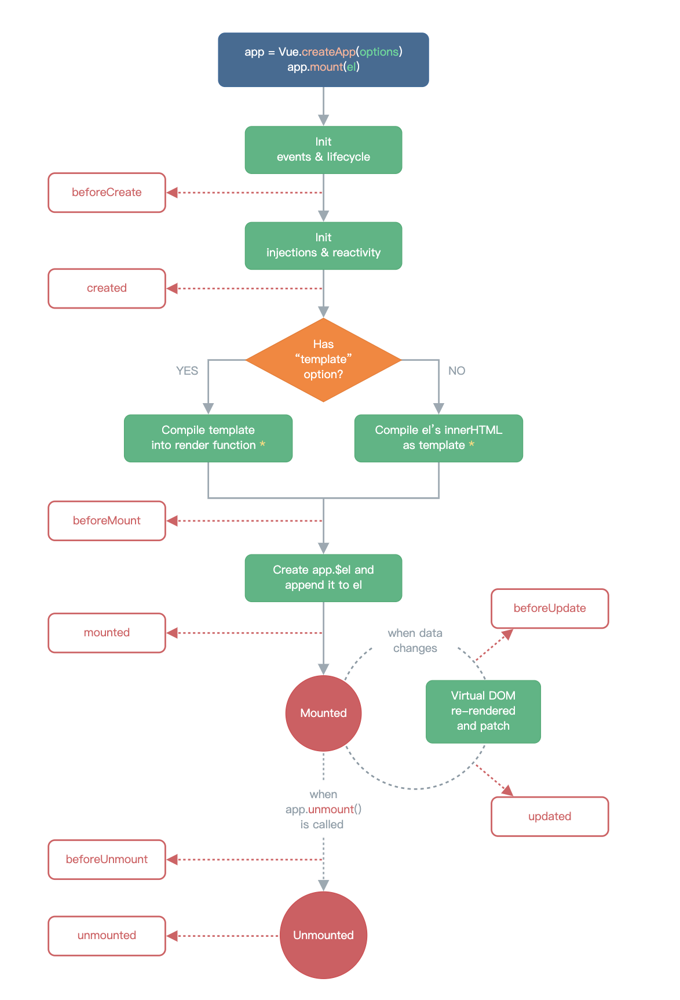

# 一、Vue3

参考资料
    [Vue3 @小满 csdn](https://xiaoman.blog.csdn.net/category_11618172_2.html)
    [Vue3 源码分析](https://mp.weixin.qq.com/mp/appmsgalbum?__biz=MzUxMDczMTE2OQ==&action=getalbum&album_id=2139738412545835009&nolastread=1#wechat_redirect)

1. `defineOptions()`

   这个宏可以用来直接在 `<script setup>` 中声明组件选项，而不必使用单独的 `<script>` 块

   ```vue
   <script setup>
   defineOptions({
     inheritAttrs: false,
     customOptions: {
       /* ... */
     }
   })
   </script>
   ```

# 二、虚拟 DOM 和 Diff 算法

参考资料
    [深度剖析：如何实现一个 Virtual DOM 算法](https://github.com/livoras/blog/issues/13)
    [patchUnkeyedChildren](https://github.com/vuejs/core/blob/main/packages/runtime-core/src/renderer.ts#L1693)
    [patchKeyedChildren](https://github.com/vuejs/core/blob/main/packages/runtime-core/src/renderer.ts#L1753)

虚拟DOM：用 js 对象描述 DOM 的层次结构
```javascript
var element = {
  tagName: 'ul', // 节点标签名
  props: { // DOM的属性，用一个对象存储键值对
    id: 'list'
  },
  children: [ // 该节点的子节点
    {tagName: 'li', props: {class: 'item'}, children: ["Item 1"]},
    {tagName: 'li', props: {class: 'item'}, children: ["Item 2"]},
    {tagName: 'li', props: {class: 'item'}, children: ["Item 3"]},
  ]
}
```
对应的 html 代码
```html
<ul id='list'>
  <li class='item'>Item 1</li>
  <li class='item'>Item 2</li>
  <li class='item'>Item 3</li>
</ul>
```

# 三、响应式

## 1. `ref`、`isRef`、`shallowRef`、`triggerRef`

   `ref`支持所有类型

   ```javascript
   import { ref, isRef, shallowRef, triggerRef } from 'vue';
   const text1 = ref({ name: "text1" }); // 深层响应式对象
   console.log(isRef(text1)); // true
   
   const text2 = shallowRef({ name: "text2" }); // 浅层响应式对象
   console.log(isRef(text2)); // true
   
   text2.value.name = "text2-1"; // 浅层响应式对象的属性发生变化，不会触发更新
   triggerRef(text2); // 强制触发浅层响应式对象的副作用（发生更新）
   ```

## 2. `reactive`、`readonly`、`shallowReactive`

   `reactive`只支持引用类型（Array, Object, Map, Set, ...）

   ```javascript
   import { reactive, readonly } from "vue";
   const obj = reactive({ name: "Tom" });
   const readonlyObj = readonly(obj);
   readonlyObj.name = "Jerry"; // Error，只读属性无法赋值
   
   const obj2 = shallowReactive({ goods: { name: "apple" } }); // 浅层响应式对象
   isReactive(goods.name) // false
   ```

注意1：**深层响应式对象更新时，会触发页面的重新渲染，此时浅层响应式对象的属性也会同步到页面上**

注意2：尽量不要将浅层响应式对象嵌套在深层响应式对象中，这会导致对象的不同部分响应性不一致。

## 3. `markRaw()`

   将一个对象标记为不可被转为代理。返回该对象本身。

   ```javascript
   const foo = markRaw({})
   console.log(isReactive(reactive(foo))) // false
   
   // 也适用于嵌套在其他响应性对象
   const bar = reactive({ foo })
   console.log(isReactive(bar.foo)) // false
   ```

> **谨慎使用！**
>
> `markRaw()` 和类似 `shallowReactive()` 这样的浅层式 API 使你可以有选择地避开默认的深度响应/只读转换，并在状态关系谱中嵌入原始的、非代理的对象。它们可能出于各种各样的原因被使用：
>
> - 有些值不应该是响应式的，例如复杂的第三方类实例或 Vue 组件对象。
> - 当呈现带有不可变数据源的大型列表时，跳过代理转换可以提高性能。
>
> 可能会导致**对象身份风险**，即执行一个依赖于对象身份的操作，但却同时使用了同一对象的原始版本和代理版本：
>
> ```js
> const foo = markRaw({
>   nested: {}
> })
> 
> const bar = reactive({
>   // 尽管 `foo` 被标记为了原始对象，但 foo.nested 却没有
>   nested: foo.nested
> })
> 
> console.log(foo.nested === bar.nested) // false
> ```
>
> 

## 4. `toRef`、`toRefs`、`toRaw`

   [toRef、toRefs](https://cn.vuejs.org/api/reactivity-utilities.html#toref)
   [toRaw](https://cn.vuejs.org/api/reactivity-advanced.html#toraw)

   ```javascript
   import { reactive, toRef, toRefs, toRaw } from "vue";
   const state = reactive({
     foo: 1,
     bar: 2,
   });
   
   // 双向 ref，会与源属性同步
   const fooRef = toRef(state, "foo");
   
   // 更改该 ref 会更新源属性
   fooRef.value++;
   console.log(state.foo); // 2
   
   // 更改源属性也会更新该 ref
   state.foo++;
   console.log(fooRef.value); // 3
   ```

   ```javascript
   const map = toRefs(state);
   console.log(map); // 普通对象，包含两个响应式属性
   console.log(map.foo, map.bar); // 两个 ref 对象，均与state的属性双向绑定
   console.log(map.foo.value, map.bar.value); // 1 2
   ```

   ```javascript
   const rawState = toRaw(state);
   console.log(rawState);  // 普通对象
   ```

## 5. 计算属性

   ```javascript
   import { computed, reactive } from "vue";
   const p1 = reactive({ name: "p1", age: 18 });
   
   // 选项式写法
   const info = computed({
     get() {
       return p1.name + "-" + p1.age;
     },
     set(val) {
       [p1.name, p1.age] = val.split("-");
     },
   });
   info.value = "p2-20"; // 修改成功
   
   // 函数式写法，只有 getter() 函数，只允许读取，不允许修改
   const info2 = computed(() => {
     return p1.name + "-" + p1.age;
   });
   info2.value = "p2-20"; // 报错
   ```


## 6. `watch`侦听器

   ```javascript
   const stop = watch(
     source, // 侦听源（返回一个值的函数，ref，响应式对象，或由以上值组成的数组）
     (newVal, oldVal) => { // 侦听源发生变化时调用的回调函数
       console.log(newVal, oldVal);
     },
     { // 配置对象
       immediate: true, // 创建侦听器时立即执行一次，oldVal=undefined。默认false
       deep: true, // 深层侦听，默认false
       flush: "pre", // pre 组件更新前调用，sync 同步执行，post 组件更新后调用，默认 pre
     }
   );
   
   stop(); // 停止侦听
   ```

   注意1：侦听`reactive`创建的对象时，deep 始终为 true（无论是否设置）

   `watchEffect`

   ```javascript
   // 立即运行一个函数，同时响应式地追踪其依赖，并在依赖更改时重新执行。
   const msg1 = ref("msg1");
   const stop = watchEffect(
     () => {  // 创建侦听器时会调用一次
       console.log(msg1.value);  // 依赖 msg1，msg1发生变化时调用此回调函数
     },
     {
       immediate: true, // 创建侦听器时立即执行一次，oldVal=undefined。默认false
       deep: true, // 深层侦听，默认false
       flush: "pre", // pre 组件更新前调用，sync 同步执行，post 组件更新后调用，默认 pre
     }
   );
   
   stop(); // 停止侦听
   ```

# 四、组件

## 1. [组件的生命周期](https://xiaoman.blog.csdn.net/article/details/122811060)



## 2. 父子组件传参 `Props`

   **任何类型**的值都可以作为props的值被传递

   ```vue
   <!-- 父组件 -->
   <template>
     <A :name="name" :age="17" :address="`bilibili`"></A>
   </template>
   
   <script setup>
   import A from "./components/A.vue";
   const name = "Taffy";
   </script>
   ```

   ```vue
   <template>
     <!-- 子组件 -->
     <div>{{ props.name }} -- {{ props.age }} -- {{ props.address }}</div>
   </template>
   
   <script setup>
   // 需要定义一个参数来接收 props
   // const props = defineProps(["name", "age", "address"]);  // 数组形式
   // 对象形式
   const props = defineProps({
     name: String,
     age: {
       type: Number,
       default: 0, // 默认值
     },
     address: String,
   });
   </script>
   ```

## 3. 自定义事件 `emit`

   父组件传递回调函数给子组件

   ```html
   <!-- 父组件 -->
   <A @show-msg="(msg) => console.log(msg)"></A>
   
   <!-- 子组件A -->
   <button @click="$emit(`show-msg`, `Hello!`)">按钮</button>
   ```

   声明要触发的事件

   ```javascript
   const emit = defineEmits(["show-msg"]);
   function handleClick() {
     emit("show-msg", "Hello!");
   }
   ```

   可以通过这种方法从子组件向父组件传参

## 4. `defineExpose()` 向父组件暴露属性或方法

   `<script setup>`中默认关闭暴露，可以通过`defineExpose()`指定要暴露的属性。

   暴露的属性可以通过模板引用进行访问

   ```vue
   <!-- 父组件 -->
   <template>
     <A ref="child"></A>
   </template>
   
   <script setup>
   import { onMounted, ref } from "vue";
   import A from "./components/A.vue";
   const child = ref(null);
   onMounted(() => {
     // 组件渲染完成后，才能获取子组件实例的属性
     console.log(child.value);
   });
   </script>
   ```

   ```vue
   <!-- 子组件 -->
   <script setup>
   const name = "A";
   defineExpose({
     name,
   });
   </script>
   ```

## 5. 注册全局组件

   ``` javascript
   // main.js
   import { createApp } from "vue";
   import App from "./App.vue";
   import GlobalVue from "./components/GlobalVue.vue";
   const app = createApp(App);
   app.component("GlobalVue", GlobalVue); // 注册全局组件
   app.mount("#app");
   ```

## 6. 递归组件

一个**单文件组件**可以通过它的文件名被其自己所引用。

```vue
<!-- Tree.vue -->
<template>
  <div class="warpper">
    <span>A组件</span>
    <Tree v-if="count > 0" :count="count - 1"></Tree>
  </div>
</template>

<script setup>
const props = defineProps(["count"]);
</script>

<style scoped>
.warpper {
  margin-left: 10px;
}
</style>
```

## 7. 动态组件

```vue
<template>
  <component :is="A"></component>
  <!-- 等价于 -->
  <A></A>
</template>

<script setup>
import A from "./components/A.vue";
</script>
```

## 8. 插槽 `slot`

8.1 插槽入口的内容会替换插槽出口的内容，若入口无内容，则显示默认内容

```vue
<!-- App.vue -->
<C>插入的内容</C> <!-- 插槽入口 -->

<!-- C.vue -->
<div>
  <slot>默认内容</slot> <!-- 插槽出口 -->
</div>
```


注意1：插槽内容可以访问到父组件的数据作用域，因为插槽内容本身是在父组件模板中定义的。

8.2 具名插槽

一个组件中包含多个插槽时，为了区分，可以使用具名插槽

```vue
<!-- App.vue -->
<template>
  <C>
    插入默认插槽
    <template v-slot:box1> 插入具名插槽 </template> <!-- v-slot:box1 可以简写为 #box1 -->
  </C>
</template>

<div class="box1">
  <slot :name="`box1`"></slot> <!-- 插槽名为 `box1` -->
</div>
<div class="box2">
  <slot></slot> <!-- 默认插槽名为 `default`，有其他具名插槽时，最好也显式标明 defalut -->
</div>
```

注意1：插槽名支持动态参数

```vue
<base-layout>
  <template #[dynamicSlotName]>
    ...
  </template>
</base-layout>
```

8.3 作用域插槽

默认情况下，插槽只能访问父组件作用域中的内容，无法访问到子组件的内容。

可以使用作用域插槽将子组件的参数传递给父组件。

```vue
<!-- 父组件 -->
<C>
  <template v-slot:box1="box1Props"> 插入具名插槽 -- {{ box1Props.msg1 }} </template>
</C>

<!-- 子组件 -->
<div class="box1">
  <slot :name="`box1`" :msg1="msg1"></slot>
</div>
```

## 9. 异步组件（通过顶层 `await`）

`<script setup>` 中可以使用顶层 `await`。结果代码会被编译成 `async setup()`：

```vue
<!-- AsyncComp.vue -->
<script setup>
const post = await fetch(`/api/post/1`).then((r) => r.json())
</script>
```

通过 `defineAsyncComponent()` 引入异步组件

```js
import { defineAsyncComponent } from 'vue'

const AsyncComp = defineAsyncComponent(() => {
  return new Promise((resolve, reject) => {
    // ...从服务器获取组件
    resolve(/* 获取到的组件 */)
  })
})
```

`defineAsyncComponent` 方法接收一个返回 **Promise** 的加载函数。这个 Promise 的 `resolve` 回调方法应该在从服务器获得组件定义时调用。

[ES 模块动态导入](https://developer.mozilla.org/en-US/docs/Web/JavaScript/Reference/Operators/import)也会返回一个 Promise，可以用它来导入 Vue 单文件组件

```js
import { defineAsyncComponent } from 'vue'

const AsyncComp = defineAsyncComponent(() =>
  import('./components/AsyncComp.vue')
)
```

通过 `<Suspense>` 使用异步组件

```vue
<template>
  <Suspense> <!-- 有两个插槽 -->
    <template #default>
      <AsyncComp></AsyncComp>
    </template>
    <template #fallback>
      <div>loading...</div> <!-- 加载完成前显示的内容 -->
    </template>
  </Suspense>
</template>
```