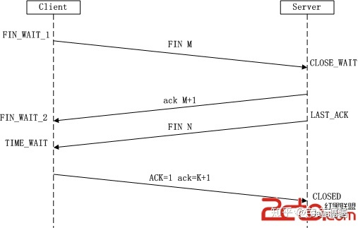

##1. 当在浏览器中输入地址后发生了什么？
>参考：https://zhuanlan.zhihu.com/p/133906695

https://&nbsp;&nbsp;&nbsp;&nbsp;lilichao.com&nbsp;&nbsp;&nbsp;&nbsp;/hello/inidex.html

    https://    协议名（http, ftp）
    lilichao.com    域名，domain，域名相当于ip地址的别名
    /hello/inidex.html    网站资源路径

具体流程：

    1. DNS解析，获取网站的ip地址
    2. 浏览器需要和服务器建立连接（tcp/ip）（三次握手）
    3. 向服务器发送请求（http协议）
    4. 服务器处理请求，并返回响应（http响应）
    5. 浏览器将响应的页面渲染
    6. 断开和服务器的连接（四次挥手）

 

## 2. 客户端如何和服务器建立（断开）连接
### 2.1 TCP三次握手（建立连接）
1. **第一次握手**：客户端A将标志位SYN置为1,随机产生一个值为seq=J（J的取值范围为=1234567）的数据包到服务器，客户端A进入SYN_SENT状态，等待服务端B确认。
2. **第二次握手**：服务端B收到数据包后由标志位SYN=1知道客户端A请求建立连接，服务端B将标志位SYN和ACK都置为1，ack=J+1，随机产生一个值seq=K，并将该数据包发送给客户端A以确认连接请求，服务端B进入SYN_RCVD状态。
3. **第三次握手**：客户端A收到确认后，检查ack是否为J+1，ACK是否为1，如果正确则将标志位ACK置为1，ack=K+1，并将该数据包发送给服务端B，服务端B检查ack是否为K+1，ACK是否为1，如果正确则连接建立成功，客户端A和服务端B进入ESTABLISHED状态，完成三次握手，随后客户端A与服务端B之间可以开始传输数据了。

 

### 2.2 TCP四次挥手（断开连接）
1. **第一次挥手**： Client发送一个FIN，用来关闭Client到Server的数据传送，Client进入FIN_WAIT_1状态。
2. **第二次挥手**： Server收到FIN后，发送一个ACK给Client，确认序号为收到序号+1（与SYN相同，一个FIN占用一个序号），Server进入CLOSE_WAIT状态。
3. **第三次挥手**： Server发送一个FIN，用来关闭Server到Client的数据传送，Server进入LAST_ACK状态。
4. **第四次挥手**： Client收到FIN后，Client进入TIME_WAIT状态，接着发送一个ACK给Server，确认序号为收到序号+1，Server进入CLOSED状态，完成四次挥手。

 

## 3. TCP/IP协议族
TCP/IP协议族中包含一组协议，这组协议规定了互联网中所有的通信的细节
网络通信的过程由四层组成
 - **应用层**
   - 软件的层面，浏览器、服务器都属于应用层
 - **传输层**
   - 负责对数据进行拆分，把大数据拆分为一个一个小包
 - **网络层**
   - 负责给数据包添加信息
 - **数据链路层**
   - 传输信息
 

### 3.1 http协议
>参考：https://www.zhihu.com/column/c_1397958370813493248

是应用层的协议，用来规定客户端和服务器间通信的报文格式

**报文**
- 浏览器和服务器之间的通信是基于请求和响应的（请求报文，响应报文）
- http协议就是对这个报文的格式进行规定
- **请求报文（request）**
  - 客户端发给服务器的报文称为请求报文
  - 请求报文的格式：
    - 请求首行
    - 请求头
    - 空行
    - 请求体
- **响应报文（response）**
  - 响应报文的格式：
    - 响应首行
    - 响应头
    - 空行
    - 响应体
 

#### 3.1.1 请求报文
    GET /04_http%E5%8D%8F%E8%AE%AE/target.html?username=KYOU&year=2023 HTTP/1.1
    Accept: text/html,application/xhtml+xml,application/xml;q=0.9,image/avif,image/webp,image/apng,*/*;q=0.8,application/signed-exchange;v=b3;q=0.7
    Accept-Encoding: gzip, deflate, br
    Accept-Language: zh,zh-CN;q=0.9,zh-TW;q=0.8,ja;q=0.7,en-US;q=0.6,en;q=0.5
    Cache-Control: max-age=0
    Connection: keep-alive
    Host: 127.0.0.1:5500
    If-Modified-Since: Mon, 27 Mar 2023 11:18:33 GMT
    If-None-Match: W/"226-18722ca8fc1"
    Referer: http://127.0.0.1:5500/04_http%E5%8D%8F%E8%AE%AE/target.html?username=KYOU&year=2023
    Sec-Fetch-Dest: document
    Sec-Fetch-Mode: navigate
    Sec-Fetch-Site: same-origin
    Upgrade-Insecure-Requests: 1
    User-Agent: Mozilla/5.0 (Windows NT 10.0; Win64; x64) AppleWebKit/537.36 (KHTML, like Gecko) Chrome/111.0.0.0 Safari/537.36
    sec-ch-ua: "Google Chrome";v="111", "Not(A:Brand";v="8", "Chromium";v="111"
    sec-ch-ua-mobile: ?0
    sec-ch-ua-platform: "Windows"

**请求首行**
`GET /04_http%E5%8D%8F%E8%AE%AE/target.html?username=KYOU&year=2023 HTTP/1.1`
- 第一部分 `GET`：
  - 表示请求的方式，get 表示发送的是 get 请求
  - 常用的是 get 请求和 post 请求
    - get 请求主要用来向服务器请求资源
    - post 请求主要用来向服务器发送数据
- 第二部分 `/04_http%E5%8D%8F%E8%AE%AE/01.html?username=KYOU`
  - 表示请求资源的路径
  - `?` 后面的内容叫做查询字符串
    - 查询字符串是一个名值对结构，一个名字对应一个值，使用`=`连接
    - 多个名值对之间使用`&`分隔
  - get 请求通过查询字符串将数据发送给服务器
    - 由于查询字符串会在浏览器地址栏中直接显示，所以
        1. 安全性较差（密码会以明文的形式直接显示在地址栏）
        2. url地址长度有限制，所以get请求无法发送较大的数据
  - post 请求通过**请求体**来发送数据
    - 在chrome中可以通过**载荷**查看
    - 无法在地址栏直接查看，所以安全性相对较好
    - 请求体的大小没有限制，可以发送任意大小的数据
    - 所以如果要向服务器发送数据集，应尽量使用post
- 第三部分 `HTTP/1.1`
  - http 协议的版本

**请求头**
- 首行以外的内容
- 请求头也是名值对结构，用来告诉服务器使用的浏览器的信息
  - `Accept`：浏览器可以接受的文件类型
  - `Accept-Encoding`：浏览器允许的压缩的编码
  - `Accept-Language`：浏览器可以接受的语言
  - `User-Agent`：用户代理，用来描述浏览器信息的字符串

**空行**
- 用来分隔请求头也请求体

**请求体**
- post请求通过请求体来发送数据

#### 3.1.2 响应报文
    HTTP/1.1 200 OK
    Vary: Origin
    Access-Control-Allow-Credentials: true
    Accept-Ranges: bytes
    Cache-Control: public, max-age=0
    Last-Modified: Mon, 27 Mar 2023 11:18:33 GMT
    ETag: W/"226-18722ca8fc1"
    Content-Type: text/html; charset=UTF-8
    Content-Length: 2043
    Date: Mon, 27 Mar 2023 11:18:47 GMT
    Connection: keep-alive
    Keep-Alive: timeout=5
**响应首行**
`HTTP/1.1 200 OK`
- `HTTP/1.1`：http 协议版本
- `200`：响应状态码
- `OK`：对响应状态码的描述
- 响应状态码的规则：
  - 1xx 请求处理中
  - 2xx 表示成功
  - 3xx 表示请求的重定向
  - 4xx 表示客户端错误
  - 5xx 表示服务器错误

**响应头**
- 响应头也是名值对结构，用来告诉浏览器响应的信息
- `Content-Type`：用来描述响应体的类型
- `Content-Length`：响应体的长度

**空行**
- 用于分割响应头和响应体

**响应体**
- 服务器返回给客户端的内容
 
